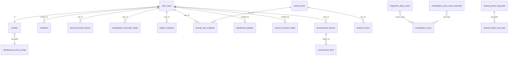
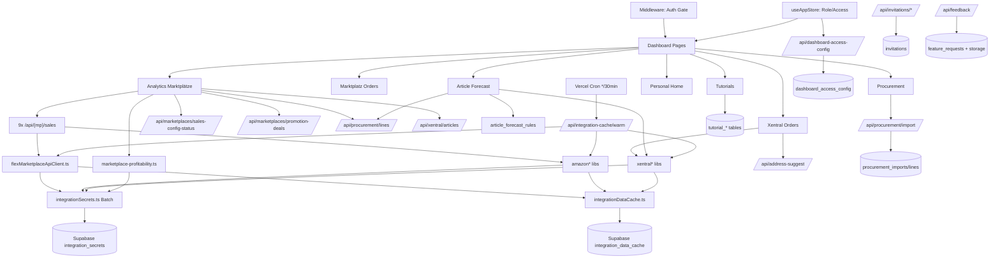

# PROJECT_REVIEW.md — Master Dashboard

_Review-Stand: 2026-04-15 · Verfasser: Architektur-Audit · Basis: statischer Scan aller Quellen, Migrationen, Lockfile, Docs und Git-Historie_

---

## Abschnitt 1 — Projekt-Identität

- **Name:** Master Dashboard (`master-dashboard` in [package.json](master-dashboard/package.json))
- **Zweck:** Zentraler Operations-Hub für ein Multi-Marktplatz-Pet-Supply-Geschäft (Petrhein/AstroPet). Verheiratet Xentral-ERP mit 9 Marktplatz-APIs (Amazon, eBay, Otto, Kaufland, Fressnapf, MediaMarkt/Saturn, Zooplus, TikTok, Shopify) und stellt darüber Analytics, Orderabwicklung, Procurement, Preis-Paritätskontrolle und Team-Workflow bereit.
- **Gelöstes Problem:** Eliminiert das Umherschalten zwischen 9+ Seller-Portalen. KPIs (Umsatz, Retouren, Profitabilität, Bestand), Produktdaten und Bestellungen kommen in einer Oberfläche zusammen. LLM-gestützte Content-Audits (Anthropic Claude + OpenAI-Fallback) für Amazon-Listings.
- **Zielgruppe:** Internes Team von AstroPet/Petrhein — Owner/Admin/Manager/Analyst/Viewer. Mehrsprachig (DE/EN/ZH), klar auf DACH-Betrieb optimiert.
- **Vision:** "Ein Dashboard, in dem jeder Business-Mitarbeiter seine Arbeit findet, ohne Tools wechseln zu müssen." Belegt durch: (a) feingranulares Rollen-/Sichtbarkeits-System in `useAppStore`, (b) Tutorial-Engine mit Mascot, (c) personalisierbare Home-Layouts, (d) Promo-Deal-Annotationen in Analytics-Charts, (e) Feedback-Kanal inkl. Attachments.
- **Reifegrad:** **Production-Ready mit aktiven Baustellen**. CI grün, gedachte Launch-Checklisten vorhanden, aber mehrere P0/P1-Punkte (Rate-Limiting, Sync-Secret-Enforcement, Migration-Drift) offen. Kein Legacy-Code — alles modern (React 19, Next 16, Tailwind 4).
- **Geschätzter Entwicklungsaufwand bisher:** ~355 TypeScript/TSX-Dateien, ~22 Migrations, ~78 API-Routen, ~25 shadcn-Komponenten plus eigene ~60 Shared-Komponenten. Grob: **600–900 Entwickler-Stunden** (3–5 Personen-Monate) vollzeitäquivalent für die sichtbare Funktionalität; davon ein hoher Anteil in den Marktplatz-Integrationen und Analytics/Profitabilitäts-Berechnungen.

---

## Abschnitt 2 — Tech-Stack (Vollständige Auflistung)

### Frontend
| Technologie | Version | Rolle | Tiefe | Alternativen |
|---|---|---|---|---|
| **Next.js** | 16.2.1 | App-Router, Server/Client-Split, Turbopack-Dev | Tief (ganzes Projekt lebt davon) | Keine sinnvolle — Remix oder eigenes SSR wäre Rückschritt |
| **React** | 19.2.4 | UI-Kernbibliothek | Tief | — |
| **TypeScript** | ^5 (strict) | Typsicherheit | Tief | — |
| **@base-ui/react** | ^1.3.0 | Unstyled Primitives | Mittel (neben Radix/shadcn) | Konsolidierung mit Radix denkbar |
| **shadcn/ui** | ^4.1.0 | Komponentenbasis | Tief (25 generierte Komponenten) | — |
| **Tailwind CSS** | ^4 | Styling | Tief | — |
| **lucide-react** | ^1.7.0 | Icons | Tief | — |
| **Zustand** | ^5.0.12 | Client-State (Rollen, UI-Flags) | Tief (ein Store: `useAppStore`) | Redux wäre overkill; Jotai denkbar |
| **TanStack Query** | ^5.95.2 | Server-State, Hooks | **Unter-genutzt** — installiert aber wenig verwendet | Ausbau wäre Gewinn |
| **TanStack Table** | ^8.21.3 | Daten-Tabellen | Mittel (Orders, Products) | — |
| **React Hook Form** | ^7.72.0 | Formulare | Mittel | — |
| **Zod** | ^4.3.6 | Validierung | **Unter-genutzt** — installiert, aber API-Inputs oft manuell geparst | Konsequenter Einsatz würde P1-Risiken schließen |
| **Recharts** | ^3.8.1 | Charts | Tief (Analytics) | — |
| **date-fns** | ^4.1.0 | Date-Utilities | Tief | — |
| **xlsx** | ^0.18.5 | Excel-Import (Procurement) | Mittel | — |
| **next-themes** | ^0.4.6 | Dark Mode | Mittel | — |
| **sonner** | ^2.0.7 | Toast-Notifications | Mittel | — |
| **cmdk** | ^1.1.1 | Command Palette | Leicht | — |
| **react-day-picker** | ^9.14.0 | Datepicker | Mittel | — |
| **class-variance-authority / clsx / tailwind-merge / tw-animate-css** | aktuell | shadcn-Infrastruktur | Mittel | — |

### Backend
| Technologie | Version | Rolle | Tiefe |
|---|---|---|---|
| **Node.js** | 20.x (CI) | Runtime | Tief |
| **Next.js Route Handlers** | 16.2.1 | API-Layer (78 Endpunkte) | Tief |
| **Supabase JS SDK** | `@supabase/supabase-js` ^2.100.1 | DB/Auth-Clients | Tief |
| **Supabase SSR** | `@supabase/ssr` ^0.9.0 | Cookie-Auth für RSC/Route Handler | Tief |
| **Resend** | ^6.9.4 | Transaktionale E-Mails (Invitations, Feedback?) | Mittel |
| **Anthropic Claude API** | via Fetch | LLM Content-Audit + Title-Review | Tief (Fachlogik in `amazonContentAudit.ts` + `amazonContentLlmClaude.ts`) |
| **OpenAI API** | via Fetch (Fallback) | LLM Alternative | Mittel |

### Datenbank
- **PostgreSQL 17.6** (Supabase-hosted, `aarch64-unknown-linux-gnu`, laut PostgREST-Logs)
- **Schema-Design:** Relationale Tabellen pro Fachdomäne + JSONB für variable Payloads (Integration-Cache, Tutorial-Szenen, Profitabilitäts-Summaries)
- **Row Level Security:** ~71 % der Tabellen (17/24) haben RLS. Kritische User-Daten geschützt, Analytics-Snapshots bewusst offen.
- **Migrations:** `supabase/migrations/` mit 22 datierten SQL-Files
- **Connection Pool:** **nur 10** (aus PostgREST-Log `Connection Pool initialized with a maximum size of 10`) — aktuell realer Engpass unter Last

### DevOps / Infrastruktur
| Komponente | Wert |
|---|---|
| Hosting | **Vercel** (`master-kpi-dashboard.vercel.app`) |
| CI | **GitHub Actions** (`.github/workflows/ci.yml`): lint + typecheck + build, Node 20, 20 min Timeout |
| Deploy-Trigger | Push auf `main` / PR |
| Cron | Ein Cron über `vercel.json`: `/api/integration-cache/warm` alle 30 min |
| Edge Runtime | Nicht genutzt — alle Routen Node-Runtime |
| Monitoring | Nichts integriert (kein Sentry, kein LogDNA sichtbar); Supabase-Logs als Primärquelle |

### Externe Services / APIs
- **Amazon SP-API** (SigV4 + LWA-Token-Refresh)
- **Otto API** (OAuth2 Client Credentials, Token-Cache in-memory)
- **Kaufland API** (HMAC-SHA256 pro Request)
- **Fressnapf / MediaMarkt-Saturn / Zooplus** (Mirakl-Standard, API-Key oder `X-API-Key`)
- **eBay API** (OAuth2 Bearer, Token-Cache)
- **TikTok Shop** (Basic Auth)
- **Shopify Admin API** (`X-Shopify-Access-Token`)
- **Xentral ERP** (PAT bevorzugt, API-Key als Fallback)
- **Anthropic Claude** (Content/Title Review)
- **OpenAI** (LLM-Fallback)
- **Nominatim / Photon OSM** (Adress-Suggestion)
- **Resend** (E-Mail)

### Dev-Tools
- **ESLint** ^9, Konfig `eslint-config-next/core-web-vitals` + `eslint-config-next/typescript`
- **Vitest** ^4.1.3 (statt Jest)
- **TypeScript** strict
- **Turbopack** (Next 16 Default)
- **Keine** Prettier-Config gefunden (Code-Formatierung durch ESLint/Editor)

---

## Abschnitt 3 — Projektstruktur

```
master-dashboard/
├─ .env.example              # Alle Env-Vars dokumentiert
├─ .env.local                # Laufzeit-Secrets (gitignored)
├─ .github/workflows/ci.yml  # GitHub Actions CI
├─ AGENTS.md                 # Hinweis für KI-Agenten: Next 16 ≠ vertrautes Next
├─ CLAUDE.md                 # Dichte KI-Referenz (Stack, Konventionen)
├─ CONTRIBUTING.md           # PR-Workflow, Review-Pflichten
├─ README.md                 # Bootstrap + Qualitäts-Gates
├─ SUPABASE_SETUP.md         # .env-Vorlage + Auth-URLs
├─ content/
│  └─ amazon_haustierbedarf_regelwerk.md  # 41 KB Amazon-Regelwerk (LLM-Context)
├─ docs/                     # Audit-, Ops-, Quality-Dokumente
│  ├─ audit/project-architecture.md
│  ├─ audit/stability-performance-audit.md
│  ├─ ops/public-launch-checklist.md
│  ├─ quality/quality-gates-baseline.md
│  └─ quality/smoke-checklist.md
├─ eslint.config.mjs
├─ middleware.ts             # Supabase SSR Auth Gate
├─ next.config.ts            # Redirects für Section-Roots
├─ package.json / package-lock.json
├─ postcss.config.mjs
├─ public/brand/             # Marktplatz-Icons (SVG), Logos
├─ src/
│  ├─ app/
│  │  ├─ (auth)/             # Login/Register/Forgot-Password
│  │  ├─ (dashboard)/        # Hauptanwendung nach Auth
│  │  │  ├─ advertising/
│  │  │  ├─ amazon/          # orders, products
│  │  │  ├─ analytics/       # marketplaces, article-forecast, procurement, performance
│  │  │  ├─ ebay|fressnapf|kaufland|mediamarkt-saturn|otto|shopify|tiktok|zooplus/  # orders, products
│  │  │  ├─ mein-bereich/    # Personal Area
│  │  │  ├─ settings/        # profile, users, tutorials
│  │  │  ├─ updates/         # Changelog-Feed
│  │  │  └─ xentral/         # orders, products
│  │  ├─ api/                # 78 Route Handlers
│  │  ├─ auth/               # callback, reset
│  │  └─ layout.tsx          # Root-Layout
│  ├─ components/ui/         # shadcn-generierte Primitives (25)
│  ├─ features/              # Feature-Folders (laut Scan unter-genutzt)
│  ├─ i18n/
│  │  ├─ config.ts
│  │  ├─ translate.ts
│  │  ├─ I18nProvider.tsx
│  │  ├─ LanguageSwitcher.tsx
│  │  └─ messages/{de,en,zh}.json
│  └─ shared/
│     ├─ components/         # ~60 eigene Komponenten
│     ├─ hooks/              # useUser, usePermissions, useMediaQuery …
│     └─ lib/                # Kernlogik, Marktplatz-Clients, Supabase-Clients, Caches
├─ supabase/
│  ├─ config.toml
│  ├─ migrations/            # 22 SQL-Migrations (datiert 20260328–20260501)
│  └─ integration_secrets_template.sql
├─ supabase-feature-requests.sql
├─ supabase-invitations.sql
├─ supabase-profiles.sql
├─ tsconfig.json
├─ vercel.json               # Cron-Konfig
└─ vitest.config.ts
```

### Zweck jeder Hauptebene
- **`src/app/(auth)/`** — Route-Group für unauthentifizierte Flows; Layout unterscheidet sich von Dashboard.
- **`src/app/(dashboard)/`** — Authentifizierte Hauptanwendung; Route-Group bündelt Sidebar-Layout.
- **`src/app/api/`** — Serverseitige Logik. Jedes Marktplatz-Verzeichnis (`amazon/`, `otto/`, …) spiegelt ein externes System. Cross-Cutting: `/api/marketplaces/` (multi-marketplace), `/api/integration-cache/` (infra).
- **`src/components/ui/`** — Rein generierte shadcn-Komponenten (Primitive). Faustregel: Nichts Business-Logik hier.
- **`src/shared/components/`** — Projekt-eigene, wiederverwendbare Komponenten. Zwei Subfolder: `layout/`, `auth/`, `charts/`, `data/`, `tutorial/`, `dev/`.
- **`src/shared/hooks/`** — React-Hooks, gekapselte State/Data-Fetches.
- **`src/shared/lib/`** — **Kernstück der Domäne**: Marktplatz-Clients, Supabase-Helpers, Caches, Profit-Logik, Xentral-Integrationsschicht.
- **`src/i18n/`** — Eigenes leichtgewichtiges Translation-Framework (Kontext + JSON).
- **`src/features/`** — Angelegte Feature-Folder-Struktur, aber in der Realität kaum genutzt. **Inkonsistenz.**
- **`supabase/`** — Versionierte Migrations + Template für Secrets-Tabelle.
- **`docs/`** — Operative Dokumentation (Audit, Launch, Qualitäts-Gates).

### Architektur-Pattern
Im Wesentlichen **Feature-Based + Layered**:
- Fachdomänen als Top-Level-Routen (`/amazon/`, `/otto/`, …) mit dazugehörigen API-Endpoints.
- Drei interne Schichten: `src/shared/lib/` (Domäne/Integration) → `src/shared/hooks/` (React-Glue) → `src/app/(dashboard)/...` (UI).
- **Kein striktes DDD**, kein BFF-Layer, keine Module-Boundaries via TypeScript-Project-References.

### Konsistenzbewertung
- **Stark konsistent:** Marktplatz-Pages nutzen alle `MarketplaceProductsView` (siehe Abschnitt 11 Duplikation).
- **Inkonsistent:** `src/features/` existiert, ist aber weitgehend leer/unbenutzt — Wahrscheinliche Spur eines früheren Refactoring-Versuchs.
- **Inkonsistent:** Große Page-Files (`analytics/marketplaces/page.tsx` = 3 921 Zeilen) durchbrechen das Komponenten-Dekompositionsprinzip massiv.

---

## Abschnitt 4 — Feature-Map

> Aufgrund der Vielzahl beschränke ich mich auf 15 repräsentative Kern-Features. Jedes steht prototypisch für eine Kategorie.

#### Feature: Analytics → Marktplätze (Multi-Marketplace Revenue & Profit)
- **Beschreibung:** Zeigt für 9 Marktplätze gleichzeitig Umsatz, Bestellungen, Retouren, Netto-Profitabilität, Trend ggü. Vorperiode; Balken- und Linien-Charts, Kacheln, Promo-Deal-Overlay.
- **Beteiligte Dateien:** [src/app/(dashboard)/analytics/marketplaces/page.tsx](master-dashboard/src/app/(dashboard)/analytics/marketplaces/page.tsx) (3 921 Zeilen), `marketplaceActionBands.ts`, `developmentReportSalesApi.ts`, API-Endpoints `/api/amazon/sales`, `/api/ebay/sales`, … (9x), `/api/marketplaces/sales-config-status`, `/api/marketplaces/promotion-deals`, `/api/xentral/articles`, `/api/procurement/lines`.
- **Einstiegspunkt:** `useEffect([period.from, period.to])` zündet 9 `loadXxxSalesRef.current()`-Calls (kürzlich auf 3er-Concurrency gedrosselt, siehe Commit).
- **Datenfluss:** Browser → Next Route Handler → `getFlexIntegrationConfig()` / Amazon SigV4 → externes Marktplatz-API → `integration_data_cache` (Supabase) → Antwort → Client-Cache (`dashboardClientCache`) → React-State → Chart.
- **Abhängigkeiten:** Jeder der 9 Marktplatz-Clients, `marketplace-profitability.ts`, `integrationSecrets.ts`, `integrationDataCache.ts`, Supabase, TanStack-Query nur punktuell.
- **State Management:** Lokaler useState + useRef-Pattern (`periodRef`, `loaderRef`); sessionStorage-Cache für `sales-config-status` (5 min); localStorage für Promo-Deals.
- **API-Endpunkte:** 9 Sales + `sales-config-status` + `promotion-deals` + Xentral-Articles + Procurement-Lines.
- **DB-Interaktion:** Lesend `integration_data_cache`, `marketplace_promotion_deals`, `article_forecast_rules`, `procurement_*`. Schreibend nur Promo-Deals + Cache.
- **UI-Komponenten:** `MarketplaceRevenueChart`, `MarketplaceTotalRevenueLinesChart`, `KPICard`, `ChartCard`, `MarketplacePriceParitySection`.
- **Edge Cases:** AbortErrors bei Supabase-Last (Commit 2026-04-15), teilweise fehlende Marktplatz-Configs (→ deaktiviert einzelne Kacheln), leere Perioden, FX-Konvertierung (teilw. nicht abgehandelt).
- **Qualitätsbewertung: 6/10.** Funktional reich, aber 3 921-Zeilen-Monolith mit verschachtelten useEffects, DOM-State und geteilter Ref-Bühne. Hohe Kopplung, schwer testbar, hohe Cognitive Load.

#### Feature: Amazon Product Editor mit LLM-Content-Audit
- **Beschreibung:** Inline-Editor für Amazon-Listings (Titel, Bullets, Beschreibung, Bilder). LLM-gestützte Titelprüfung gegen Amazon-Regelwerk.
- **Beteiligte Dateien:** `AmazonProductEditor.tsx` (1 097 Z.), `AmazonRulebookDialog.tsx`, `useAmazonDraftEditor.ts`, `useAmazonContentAudit.ts`, `amazonContentAudit.ts`, `amazonContentPromptBuilder.ts`, `amazonContentLlmClaude.ts`, `amazonTitleLlmReview.ts`, `/api/amazon/products/drafts/route.ts`, `/api/amazon/content-audit/route.ts`, `/api/amazon/rulebook/route.ts`, `content/amazon_haustierbedarf_regelwerk.md`.
- **Einstiegspunkt:** Button "Bearbeiten" auf `/amazon/products` öffnet Dialog.
- **Datenfluss:** UI-Änderung → Draft-Hook → POST `/api/amazon/products/drafts` → Supabase `amazon_product_drafts`. "Title-Review" → POST `/api/amazon/content-audit` → Claude API (Tool-Use) → strukturiertes Ergebnis → UI-Highlighting.
- **Abhängigkeiten:** Claude-API-Key, OpenAI-Fallback, `amazon_product_drafts`-Tabelle (RLS: Owner only).
- **State Management:** React Hook Form + Draft-Hook; Autosave als localStorage-Shadow.
- **DB-Interaktion:** CRUD `amazon_product_drafts`; lesend Regelwerk (aus Datei).
- **UI:** `AmazonProductEditor`, `AmazonRulebookDialog`, `AmazonDraftSuggestionTrigger`.
- **Edge Cases:** Migration-Fehler → `tableMissing: true` → Client zeigt Platzhalter.
- **Qualitätsbewertung: 7/10.** Saubere Separation zwischen Hook/Audit-Logik/UI, aber Editor-Datei zu groß (weitere Zerlegung in Sub-Komponenten angezeigt).

#### Feature: Price Parity (Preis-Konsistenz über Marktplätze)
- **Beschreibung:** Vergleicht Artikelpreise zwischen allen Marktplätzen, zeigt Abweichungen, flaggt Verletzungen. Einsatz für MAP-/UVP-Disziplin.
- **Beteiligte Dateien:** `/api/marketplaces/price-parity/route.ts` (725 Z.), `MarketplacePriceParitySection.tsx`, `marketplace-profitability.ts`.
- **Einstiegspunkt:** Sektion auf Marktplatz-Analytics.
- **Datenfluss:** Für jeden Marktplatz: Produktliste → Preis-Extraktion → Aggregation.
- **Qualitätsbewertung: 5/10.** 725-Zeilen-Route, kreuzt mehrere Marktplätze → prädestiniert für Zerlegung (jedes Marktplatz-Preis-Parsing in eigenen Helper).

#### Feature: Stock Sync (Bestand schreiben)
- **Beschreibung:** Überträgt Bestände auf Marktplätze. Typisch Shopify-Inventory + Mirakl-Plattformen.
- **Beteiligte Dateien:** `/api/marketplaces/stock-sync/route.ts` (624 Z.), `/api/shopify/products/stock-sync/route.ts` (309 Z.).
- **Qualitätsbewertung: 5/10.** Große Route mit vielen if-Branches pro Marktplatz.

#### Feature: Integration Cache Warmup (Vercel-Cron)
- **Beschreibung:** Warmt alle 30 min die `integration_data_cache`-Tabelle vor (Orders, Articles, Produktlisten) — damit Benutzer beim Seitenaufruf nicht auf langsame Marktplatz-APIs warten.
- **Beteiligte Dateien:** `/api/integration-cache/warm/route.ts`, `vercel.json`, alle `primeXxxCache()`-Funktionen in den Marktplatz-Libs.
- **Einstiegspunkt:** Vercel-Cron HTTP-POST mit `Authorization: Bearer {CRON_SECRET}`.
- **Datenfluss:** Cron → Warm-Route → iteriert Marktplätze → schreibt `integration_data_cache`.
- **DB-Interaktion:** Schreibend `integration_data_cache`.
- **Qualitätsbewertung: 7/10.** Solides Pattern; Auth fail-closed gegen `CRON_SECRET`/`INTEGRATION_CACHE_WARM_SECRET` — **aber Audit warnte vor fallback-freundlichem Default. Prüfen.**

#### Feature: Role-Based UI + Access Config
- **Beschreibung:** Rollen (Owner/Admin/Manager/Analyst/Viewer) mit feingranularer Sichtbarkeits-/Berechtigungskontrolle pro Sidebar-Item, Page, Widget, Action. Live-Testen via Role-Toolbar für Dev.
- **Beteiligte Dateien:** `useAppStore.ts` (Zustand-Store), `roles.ts`, `DashboardRouteAccessGuard.tsx`, `RoleTestAccessToolbar.tsx`, `/api/dashboard-access-config/route.ts`, Supabase-Tabelle `dashboard_access_config`.
- **Qualitätsbewertung: 8/10.** Durchdacht, erweiterbar; Einziger Schwachpunkt: Single-Row-Config ist ein SPoF wenn JSON korrupt.

#### Feature: Tutorials & Onboarding mit Mascot
- **Beschreibung:** Interaktive Tour-Overlays mit animiertem Space-Cat-Mascot. Szenen markieren UI-Targets (CSS-Selector), Progress pro User persistiert.
- **Beteiligte Dateien:** `SpaceCatMascot.tsx` (694 Z.), `TutorialOverlay.tsx`, `TutorialRuntimeController.tsx`, `TutorialNavContext.tsx`, `MascotReferencePanel.tsx`, Tabellen `tutorial_tours`, `tutorial_scenes`, `tutorial_user_progress`, `tutorial_scene_nav_highlight`.
- **Qualitätsbewertung: 7/10.** Breite Feature-Ausstattung, aber Mascot-Animationslogik in 700-Z.-Datei.

#### Feature: Invitation-Flow (Team-Einladung)
- **Beschreibung:** Owner lädt neue Teammitglieder ein, Einladung per Token-Link, Registration ohne E-Mail-Bestätigung.
- **Beteiligte Dateien:** `/api/invitations/*` (5 Routen), `invitations`-Tabelle.
- **Edge Cases/Risiken:** `lookup`-Endpoint öffentlich, **kein Rate-Limit (P1)** — Audit flaggt Enumerations-Risiko.
- **Qualitätsbewertung: 6/10.** Funktional komplett, Security-Hardening fehlt.

#### Feature: Feedback & Feature-Requests
- **Beschreibung:** Benutzer reicht Feature-Wünsche ein, kann Dateien anhängen (Screenshots), Owner kann antworten.
- **Beteiligte Dateien:** `/api/feedback/route.ts` (462 Z.), `/api/feedback/download/route.ts`, Tabelle `feature_requests` + Storage-Bucket `feedback-attachments` (5 MB).
- **Qualitätsbewertung: 7/10.** Komplettes Feature, 462-Zeilen-Route allerdings Indikator für Splits.

#### Feature: Procurement-Import
- **Beschreibung:** Excel-Datei mit Bestellmetadaten (Container, SKU, Mengen, Hafen-Ankunftsdatum) wird hochgeladen, geparst, gespeichert und in Forecast einbezogen.
- **Beteiligte Dateien:** `/api/procurement/import/route.ts`, `/api/procurement/lines/route.ts`, `procurement_imports`, `procurement_lines`, `xlsx`-Library.
- **Qualitätsbewertung: 7/10.**

#### Feature: Article Forecast
- **Beschreibung:** SKU-Level-Prognose aus Xentral-Verkaufshistorie + Inbound-Procurement → Low-Stock-/Critical-Warnings.
- **Beteiligte Dateien:** `analytics/article-forecast/page.tsx` (1 568 Z.), `xentralArticleForecastProject.ts`, `article_forecast_rules`-Tabelle.
- **Qualitätsbewertung: 6/10.** 1 568-Z.-Page.

#### Feature: Xentral Orders Merge
- **Beschreibung:** Zusammenführung von Xentral-Aufträgen mit Marktplatz-Feeds zu einer vereinheitlichten Order-Ansicht inkl. Adresskorrektur-Vorschläge (Nominatim/Photon).
- **Beteiligte Dateien:** `xentral/orders/page.tsx` (1 839 Z.), `xentralOrderMerge.ts`, `/api/xentral/orders/route.ts`, `/api/address-suggest/route.ts` (439 Z.).
- **Qualitätsbewertung: 5/10.** Größter Page-Monolith nach Marktplatz-Analytics.

#### Feature: Updates Feed
- **Beschreibung:** Changelog/Release-Feed für Nutzer; Karten expandierbar, Unread-Highlight.
- **Beteiligte Dateien:** `updates/page.tsx` (983 Z.), `/api/updates/route.ts`, `dashboard_updates`-Tabelle.
- **Qualitätsbewertung: 6/10.** UI-Size deutet auf Split hin (Lister + Card-Komponente).

#### Feature: Personal Home Layout
- **Beschreibung:** User arrangiert Kacheln auf der Startseite; Layout wird pro User persistiert.
- **Beteiligte Dateien:** `personal_home_layouts`-Tabelle, (Layout-Komponenten in `app/(dashboard)/page.tsx`).
- **Qualitätsbewertung: 7/10.**

#### Feature: i18n (DE/EN/ZH)
- **Beschreibung:** Dot-Path-Translation mit Fallback DE, Parameter-Substitution, Sprachumschalter.
- **Beteiligte Dateien:** `src/i18n/*`, `src/i18n/messages/{de,en,zh}.json`.
- **Qualitätsbewertung: 8/10.** Kompakt, klar, fallback-tolerant; fehlt aber SSR-I18n (alles Client).

---

## Abschnitt 5 — Datenmodell & Schema-Architektur

### ER-Diagramm (Kernbeziehungen)



### Vollständige Tabellenliste (gruppiert)

**Auth/Profil**
- `profiles` — PK `id` (FK → `auth.users`), `email`, `full_name`, `role ENUM(owner|admin|manager|analyst|viewer)`, `created_at`, `updated_at`; Index `profiles_role_idx`; RLS: self-only. Trigger aktualisiert `updated_at`.
- `invitations` — PK `id` UUID, `email`, `role`, `token` UNIQUE, `status`, `invited_by` FK, `expires_at`; Index `invitations_email_idx/status_idx`; **RLS: nicht aktiviert** — Public-Lookup. **Risiko: Rate-Limit fehlt.**
- `dashboard_access_config` — PK `id` TEXT ('default'), `config` JSONB; Singleton; RLS: Owner-Write.
- `personal_home_layouts` — PK `user_id` UUID, `layout_json` JSONB; RLS: self.

**Marktplatz-Sync (7 Tabellen nach identischem Schema: `otto_sync`, `kaufland_sync`, `shopify_sync`, `fressnapf_sync`, `mms_sync`, `zooplus_sync`, `tiktok_sync`)**
- PK `id` BIGINT generated, Spalten: `period_from`, `period_to`, `status ENUM(ok|error)`, `error`, `summary` JSONB, `previous_summary`, `points` JSONB, `previous_points`, `revenue_delta_pct`, `meta` JSONB, `synced_at`, `created_at`, `updated_at`.
- Constraint: UNIQUE `(period_from, period_to)`.
- Index: period-range.
- RLS: nicht aktiviert (read-only Analytics-Snapshots).

**Marktplatz-Features**
- `marketplace_promotion_deals` — PK `id` UUID, `user_id` FK, `label`, `date_from`, `date_to`, `color`, `marketplace_slug`; RLS: user-owned.
- `marketplace_price_stock_overrides` — PK `id` UUID, `sku`, `marketplace_slug`, `price_eur`, `stock_qty`, `updated_by` FK; UNIQUE `(sku, marketplace_slug)`. **RLS: nicht aktiviert** (shared overrides — bewusst).

**Integration Layer**
- `integration_data_cache` — PK `cache_key` TEXT, `source`, `payload` JSONB, `fresh_until`, `stale_until`, `updated_at`; Indizes `source_idx`, `fresh_until_idx`. **RLS: nicht aktiviert** (Audit flagged). Stochastische Cleanup-Logik (5 %) löscht Rows `stale_until < now() - 7 days`.
- `integration_secrets` (aus Template) — PK `key` TEXT, `value` TEXT, `updated_at`.

**Procurement**
- `procurement_imports` — `id` UUID, `created_at`, `user_id`, `file_name`, `row_count`.
- `procurement_lines` — `id` UUID, `import_id` FK, `sort_index`, `container_number`, `manufacture`, `product_name`, `sku`, `amount`, `arrival_at_port`, `notes`; Index `import_sort_idx`; RLS: auth-read.

**Produkte**
- `amazon_product_drafts` — `id` UUID, `marketplace_slug`, `mode`, `status`, `sku`, `source_snapshot` JSONB, `draft_values` JSONB, `created_by`, `updated_by`, Timestamps; Indizes `marketplace_mode_idx`, `sku_idx`; **RLS: owner-only**.
- `xentral_product_tag_defs` — PK `label` TEXT, `color`, `updated_at`, `updated_by`; seed-daten (3 Tags).
- `xentral_product_sku_tags` — PK `sku` TEXT, `tag_label` (nullable), `updated_at`, `updated_by`.

**Analytics**
- `article_forecast_rules` — PK `id` UUID, `scope ENUM(fixed|temporary)` UNIQUE, `sales_window_days`, `projection_days`, `low_stock_threshold`, `critical_stock_threshold`, `include_inbound_procurement`, `updated_at`, `updated_by`.
- `dashboard_updates` — PK `id` UUID, `date`, `title`, `text`, `release_key`, `created_by`, `created_at`; Index `date_idx`; RLS aktiv.
- `feature_requests` — PK `id` UUID, `user_id`, `user_email`, `title`, `message`, `status`, `owner_reply`, `page_path`, `attachments` JSONB; Indizes `created_at_idx`, `user_id_idx`. RLS: nicht aktiviert (public-submit).

**Tutorials**
- `tutorial_tours` — PK `id` UUID, `tutorial_type ENUM(onboarding|release_update)`, `role`, `release_key`, `version`, `title`, `summary`, `enabled`, `required`, `status ENUM(draft|published)`, Timestamps; Index `lookup_idx`.
- `tutorial_scenes` — PK `id` UUID, `tour_id` FK, `order_index`, `text`, `target_selector`, `mascot_emotion`, `mascot_animation`, `unlock_sidebar`, `advance_mode ENUM(manual|after_typewriter)`, `estimated_ms`; UNIQUE `(tour_id, order_index)`.
- `tutorial_user_progress` — PK `id` UUID, `user_id`, `tour_id`, `tutorial_type`, `role`, `release_key`, `current_scene_index`, `started_at`, `last_seen_at`, `completed_at`, `dismissed_at`, `updated_at`; UNIQUE `(user_id, tour_id)`.
- `tutorial_scene_nav_highlight` — (genauer Schema siehe Migration 20260405).

### Migrationshistorie
22 Migrations von `20260328120000` (Dashboard-Access-Config) bis `20260501120000` (Amazon Product Drafts). Deutlich: **konsequent datiert, inkrementell, pro Domäne.** Eine gelöschte Migration (`20260402120000_tutorial_tours.sql`) steht in Git-Deletion; ihre Nachfolgerin `20260402120100_tutorial_tours.sql` ist die aktive Variante.

### Datenvalidierung
- **Frontend:** React-Hook-Form + Zod in Formularen
- **Backend:** **Oft manuell** (String-Parsing, `Number()`-Coercion) — keine durchgängige Zod-Validierung an Route-Eingängen. **Technische Schuld.**
- **DB-Ebene:** Check-Constraints nur sparsam (ENUMs, UNIQUE).

### Fehlende Validierungen/Constraints
- Kein Check für `date_from ≤ date_to` auf `marketplace_promotion_deals` (logische Prüfung nur im API-Layer).
- `integration_data_cache.stale_until ≥ fresh_until` nicht DB-enforced.
- `tutorial_scenes.order_index ≥ 0` nicht enforced.
- `profiles.role` als TEXT ohne CHECK — Eingabe `"random"` würde durchkommen, wenn jemand den Admin-Client missbraucht.

---

## Abschnitt 6 — API-Architektur

### Design-Paradigma
**REST-ähnlich mit Next.js Route Handlers.** Kein tRPC, kein GraphQL. Jede Route ist eine Datei `src/app/api/.../route.ts` mit `GET/POST/PUT/DELETE`-Exports.

### Vollständige Endpunkt-Liste (78 Routen)
Gruppiert nach Domäne:

**Marktplätze — Sales/Orders/Products (43)**
- `/api/amazon/` (11): `/`, `sales`, `orders`, `products`, `products/[sku]`, `products/drafts`, `orders/solicitation`, `rulebook`, `content-audit`, (weitere)
- `/api/otto/` (4): `/`, `sales`, `orders`, `products`
- `/api/kaufland/` (4), `/api/fressnapf/` (4), `/api/mediamarkt-saturn/` (4), `/api/zooplus/` (4), `/api/tiktok/` (4), `/api/shopify/` (4 inkl. `products/stock-sync`), `/api/ebay/` (3)

**Marktplätze — Cross-Cutting (6)**
- `/api/marketplaces/sales-config-status` — 9-fach Config-Check
- `/api/marketplaces/price-parity` — Multi-Marketplace-Vergleich
- `/api/marketplaces/stock-sync` — Batch-Bestand
- `/api/marketplaces/price-stock-overrides` — Manual Overrides
- `/api/marketplaces/promotion-deals` — User-Annotationen
- `/api/marketplaces/integration-cache/refresh` — Manueller Invalidator

**Xentral (8):** `/`, `articles`, `orders`, `product-tags`, `product-tags/sku`, `product-tags/definitions`, `delivery-sales-cache/sync`, `sales-order-shipping`

**Infrastruktur (3):** `/api/integration-cache/warm`, `/api/cache`, `/api/address-suggest`

**Analytics (2):** `/api/analytics/marketplace-article-sales`, `/api/article-forecast/rules`

**Procurement (2):** `/api/procurement/import`, `/api/procurement/lines`

**User/Team (7):** `/api/users`, `/api/invitations/*` (5), `/api/dashboard-access-config`

**Content & Metadata (4):** `/api/updates`, `/api/tutorials/progress`, `/api/tutorials/editor`, `/api/tutorials/runtime`

**Feedback (2):** `/api/feedback`, `/api/feedback/download`

**Dev (1):** `/api/dev/local-auth`

### Request/Response-Format
- **Request:** JSON-Body für POST/PUT; Query-Params für GET (`fromYmd`, `toYmd`, `status`, `all`, `limit`, `includePrices`, `includeSales`).
- **Response Success:** JSON, Schema ad-hoc pro Route (kein standardisiertes Envelope).
- **Response Error:** `{ error: string }`, HTTP-Codes 400/401/403/404/500/503.

### Middleware-Chain
`middleware.ts` (Edge-nahe) → Auth-Check → Public-Path-Allowlist → optional Lokal-Dev-Auth.

Innerhalb der Routen gibt es **keine zusätzliche Middleware** (kein `withAuth()`-HOF, keine kanonische Guard-Funktion). Auth-Check ist pro Route dupliziert, ~30 Routen verwenden das Pattern:
```ts
const supabase = await createServerSupabase();
const { data: { user } } = await supabase.auth.getUser();
if (!user) return NextResponse.json({ error: "Nicht authentifiziert." }, { status: 401 });
```
→ **Duplikation + potenzielle Auslassung** (wenn jemand vergisst, ist die Route offen).

### Rate-Limiting
**Keines.** Weder auf Middleware-Ebene noch in Routen. `/api/invitations/lookup` ist öffentlich und unlimitiert — explizit als P1-Risiko im Audit vermerkt.

### Konsistenz-Bewertung
| Dimension | Bewertung |
|---|---|
| URL-Naming | Gut (`/api/{marketplace}/{resource}`) |
| HTTP-Methoden | Gut (GET/POST/PUT/DELETE sinnvoll eingesetzt) |
| Error-Format | Einheitlich `{ error: string }`, teils erweitert mit Daten |
| Status-Codes | Konsistent |
| Success-Envelope | **Uneinheitlich** (mal `{ deals: [] }`, mal `{ items: [] }`, mal top-level Objekt) |
| Input-Validierung | **Inkonsistent** — manchmal Zod, oft manuell |

---

## Abschnitt 7 — Symbiose-Map (WICHTIGSTER Abschnitt)

### Wie Features zusammenspielen — Mermaid



### Shared Dependencies (von mehreren Features genutzt)

| Modul | Nutzer | Kritikalität |
|---|---|---|
| `integrationSecrets.ts` | ALLE Marktplatz-Integrationen, Xentral, Amazon, LLM | **Kritisch** — wenn defekt, fällt das ganze System aus |
| `integrationDataCache.ts` | ALLE Marktplatz-Integrationen | **Kritisch** — Performance abhängig; Bug → User-Latenz |
| `flexMarketplaceApiClient.ts` | 8 Marktplätze (Otto/Kaufland/Fressnapf/MMS/Zooplus/TikTok/Shopify/eBay) | **Kritisch** |
| `supabase/admin.ts` | Alle service-role-Operationen (Invites, Drafts, Admin-CRUDs) | **Kritisch** — 15-s-Global-Timeout; SPoF |
| `supabase/server.ts` | Alle User-authentifizierten Route Handler | **Kritisch** |
| `marketplace-profitability.ts` | 9 Sales-Endpoints + Analytics-Page | **Hoch** |
| `useAppStore` (Zustand) | Jede Dashboard-Seite (Rollen, Sichtbarkeit) | **Hoch** |
| `MarketplaceProductsView.tsx` | 8 Marktplatz-Produktseiten | **Hoch** |
| `I18nProvider` | ALLE UIs | **Kritisch** |

### Kritische Pfade

**Pfad 1 — Dashboard-Load:**
Browser → Middleware → Supabase-Auth → `/api/dashboard-access-config` → Client-Render → 9 parallele Sales-Calls → **Supabase-Connection-Pool** (10!). Ein Flaschenhals an dieser Stelle legt die ganze App lahm (siehe Vorfall 2026-04-15 — Postgres-Statement-Timeout).

**Pfad 2 — Cron-Warmup:**
Vercel-Cron → `/api/integration-cache/warm` → iteriert Marktplätze seriell (minimal gestaffelt) → jedes Marktplatz-API. Wenn ein Marktplatz hängt, verschluckt der Warmup Zeit.

**Pfad 3 — Amazon-Order-Pull (teuerste Route):**
Browser → Route → SigV4-Sign → SP-API → 429 → Retry mit Backoff bis 120 s → LWA-Token-Refresh → Cache.

### Coupling-Analyse
- **Zu eng gekoppelt:**
  - `analytics/marketplaces/page.tsx` ↔ 9 Sales-APIs + Profitabilitäts-Lib + Promo + Xentral + Procurement = alles in einer Datei. Änderung an einem Teil wirkt sich auf die ganze Page aus.
  - `flexMarketplaceApiClient` ↔ 8 Marktplätze als einzelnes Spec-Objekt. Gut für DRY, aber wenn TikTok eine Mirakl-abweichende Besonderheit braucht, wird die Spec ausgefranst.
- **Zu lose gekoppelt:**
  - Auth-Checks in API-Routen. Kein Guard-Decorator, jede Route kann "vergessen" werden. Tatsächlich hat nur ein Teil der Routen Owner-Check (siehe `/api/users`, `/api/marketplaces/price-stock-overrides` → ja; viele `/api/{mp}/sales` → nein, weil public-read gedacht).
  - `src/features/` existiert als Konvention, wird aber nicht genutzt — weder als Ordner noch als Modul-Boundary.

### Wenn Feature X sich ändert — was bricht alles?

| Geänderter Modul | Auswirkung |
|---|---|
| `integrationSecrets.ts` Schema | JEDE Marktplatz-Integration. Keine Tests. |
| `flexMarketplaceApiClient.ts` Config-Struktur | 8 Marktplätze + `sales-config-status`-Endpoint |
| Supabase-Schema `integration_data_cache` | ALLE Caches werden ungültig, Warm-Cron crasht, User warten auf Live-API |
| `useAppStore`-Schema | Alle Dashboard-Seiten (Persist-Migration nötig) |
| `DashboardRouteAccessGuard` | Jede geschützte Dashboard-Seite |
| `MarketplaceProductsView` Props | 8 Marktplatz-Produktseiten |
| `middleware.ts` Public-Path-Liste | Auth-Regressionen |

### Beispielhafte Verbindungen (wie im Prompt gefordert)

```
[analytics/marketplaces/page.tsx] --[fetch]--> [9x /api/{mp}/sales/route.ts]
Grund: Page zeigt Umsatz je Marktplatz gleichzeitig
Risiko: Parallel-Storm ruiniert Supabase-Pool (aktueller Vorfall)
Verbesserung: Serverseitiger Aggregator-Endpoint `/api/analytics/marketplace-overview`, der die 9 Calls serverseitig bündelt + cached
```

```
[flexMarketplaceApiClient.ts] --[batch-read]--> [integrationSecrets.ts]
Grund: Config-Laden in einer DB-Query statt 12
Risiko: Wenn Supabase down, alle 8 Marktplätze blind
Verbesserung: In-Memory-Warm-Cache vor App-Start (z. B. at cold boot)
```

```
[marketplace-profitability.ts] --[after fix]--> [integrationSecrets.ts::readIntegrationSecretsBatch]
Grund: Fee-Policy liest 3 Keys in einer Query statt drei
Risiko: vorher 3×9 = 27 Reads pro Page-Load
Verbesserung: Bereits umgesetzt im aktuellen Commit
```

```
[Tutorials] --[read]--> [tutorial_tours + tutorial_scenes + tutorial_user_progress]
Grund: Owner kann Tutorials bearbeiten, User sieht Progress
Risiko: Falsche RLS kann Admin-Drafts an Users leaken
Verbesserung: Spezifische Tests mit anon/user/owner Rollen
```

---

## Abschnitt 8 — Authentifizierung & Autorisierung

### Auth-System
**Supabase Auth** mit E-Mail/Passwort + Invitations-Workflow.

### Vollständige Flows
**Login:** `/login` → `UserAuthOverlay` → `supabase.auth.signInWithPassword()` → Session-Cookies → Redirect `/`.
**Register (invite-based):** Invite-Link `?token=...` → `/register` → `/api/invitations/lookup` → Password-Formular → `/api/invitations/complete` → Session.
**Password-Reset:** `/forgot-password` → `supabase.auth.resetPasswordForEmail()` → User bekommt Link → `/auth/reset` callback → Neues Passwort.
**Callback:** `/auth/callback` → verarbeitet OAuth/Magic-Link-Code.

### Token-Handling
- **Session-Cookies** via `@supabase/ssr` (`createServerClient` / `createBrowserClient`). Cookies auto-refresh.
- **JWT** implizit in Supabase Auth (sichtbar in Edge-Logs als Bearer).
- **Service-Role-Key** serverseitig in `admin.ts`, nie client-exposed.

### Rollen & Berechtigungen
Rollen-Quelle (in `roles.ts` + `isOwnerFromSources()`):
1. DB `profiles.role`
2. `user.app_metadata.role`
3. `user.user_metadata.role`

Rollen: `owner`, `admin`, `manager`, `analyst`, `viewer`. Manuelle Checks in Route-Handlern (kein HOF/Decorator).

**Dashboard-Sichtbarkeit** (client-seitig): `useAppStore.rolePermissions`/`rolePageAccess`/`roleWidgetVisibility` — feingranular. Persistiert in Supabase `dashboard_access_config`.

### Sicherheitslücken & Schutzmaßnahmen
- ✅ Service-Role nur server-side.
- ✅ RLS auf User-Daten (Profiles, Promo-Deals, Drafts, Layouts, Tutorial-Progress).
- ❌ **Kein Rate-Limit** — gesamter API-Layer.
- ❌ **`/api/invitations/lookup`** unauthentisiert, E-Mail-Enumeration möglich.
- ⚠ **Service-Role-Flut** — viele Routen instanziieren `createAdminClient()`. Jeder Fehler im Admin-Client kann User-DB-Zugriff ungewollt öffnen.
- ⚠ **CSRF-Schutz** — Next.js-Standard (SameSite-Cookies). Keine eigene CSRF-Token-Middleware; bei POST-APIs mit Session-Auth Standard-Schutz ausreichend.
- ⚠ **CORS** — nicht explizit gesetzt; API wird von eigener Domain genutzt.
- ⚠ **XSS** — React escapet Default; `dangerouslySetInnerHTML` bei Scan nicht gefunden.
- ⚠ **Dev-Auth-Bypass** — `/api/dev/local-auth` existiert. Middleware erlaubt es nur bei `localhost`/`127.0.0.1`. Wenn Produktions-URL fehlkonfiguriert ist, Risiko.

---

## Abschnitt 9 — Error-Handling & Resilience

### Capture- und Weiterleitung
- **Route-Handler:** `try/catch` → `NextResponse.json({ error: ... }, { status })`.
- **Client:** `fetch().catch(...)` → lokaler Fehler-State → Toast (`sonner`).
- **Kein globaler Error Boundary** im React-Tree gefunden.

### Logging
- **Server:** `console.log/error`. Wandert in Vercel-Logs.
- **Kein strukturiertes Logging** (kein Pino/Winston, kein JSON-Format).
- **Supabase-Logs** als zweite Quelle (statement-timeouts, Connection-Events).
- **Kein Sentry/DataDog** integriert.

### Retry/Circuit-Breaker/Graceful Degradation
- **Amazon SP-API:** `amazonSpApiGetWithQuotaRetry()` — Exponential Backoff auf 429 bis 120 s. ✅
- **Flex-Marktplätze:** Konfigurierbar `MAX_429_RETRIES` (default 8) + `PAGINATION_DELAY_MS` (450 ms). ✅
- **Supabase-Admin-Client:** 15 s Global-Timeout. ✅
- **Integration-Data-Cache:** In-Flight-Dedup (Map in `integrationDataCache.ts`), Stale-while-revalidate. ✅
- **Integration-Secrets:** Fehler kurz gecached (30 s) → verhindert DB-Retry-Storm bei Supabase-Down. ✅
- **Kein Circuit-Breaker** für komplette Marktplatz-Ausfälle — wenn Otto hängt, blockiert Warm-Cron verzögert.
- **Keine Graceful-Degradation für Client:** Kein "Offline-Modus", keine Service-Worker.

### Edge Cases bei Netzwerk/DB-Ausfall
- **Supabase down:** Routen geben 500 zurück. Cache-Tabellen unerreichbar → User sieht Live-API-Latenz (Amazon bis 120 s).
- **Marktplatz-API down:** Cache dient Stale-Daten (bis 24 h). ✅
- **Unbehandelt:** Xentral-Delivery-Sales-Cache schreibt in lokale JSON-Datei (!) — kein File-Locking, potenzielle Race-Conditions bei parallelen Syncs.

### Unbehandelte Fehler
- LLM-Fallback-Kaskade bricht still, wenn sowohl Claude als auch OpenAI fehlschlagen.
- `integration_secrets`-Fallback gibt leeren String zurück (kein expliziter Alert).
- Xentral-PAT/Key-Fallback funktioniert still — Missing-Key-Feedback schwach.

---

## Abschnitt 10 — Performance & Optimierung

### Bundle/Code-Splitting
- **Next.js App Router** splittet automatisch pro Route.
- **Turbopack** in Dev (Next 16 Default); `next build` in Prod.
- **Kein explizites `dynamic()`** mit `ssr: false` im Scan (einige Komponenten wie `AmazonProductEditor` könnten davon profitieren).
- **Chunks:** Durch 1 097-Z.-Editor + 1 534-Z.-Sidebar + 3 921-Z.-Analytics Page werden einzelne Chunks groß.

### Lazy Loading
- Begrenzt. Meiste Komponenten sind synchron importiert. Optimierungspotenzial: Dialog-Content (`MarketplaceProductShellDialog` 599 Z.) dynamisch laden.

### Caching-Strategien
| Layer | Mechanismus |
|---|---|
| **Browser** | localStorage (`dashboardClientCache.ts`), sessionStorage (Config-Status), `useAppStore` persistiert |
| **Route Handler (in-memory)** | `_inflight`-Dedup, Env-/DB-Secret-Memory-Cache 5 min |
| **Supabase Tabelle** | `integration_data_cache` (fresh 15 min, stale 24 h) |
| **CDN** | Vercel Edge (statische Assets) |
| **DB-Query** | `readIntegrationSecretsBatch` bündelt Reads |

### DB-Query-Probleme
- **N+1 in Fees:** War vorhanden in `marketplace-profitability.ts` (3 Reads pro Call × 9 parallele Routes), **heute per Commit behoben**.
- **Fehlende Indizes:** Keine auffälligen Lücken — `integration_data_cache_fresh_until_idx` existiert.
- **Unnötige Joins:** Keine auffälligen.
- **Connection Pool = 10** ist im Verhältnis zur Request-Flut der Marktplatz-Page zu klein.

### Bild-Optimierung
- **kein `<Image/>`-Review** per Scan gemacht, aber Lint-Warning `@next/next/no-img-element` aktiv — deutet auf fehlgenutzte ``-Tags. Sollte zu `next/image` migriert werden.

### Render-Performance
- **Analytics-Page** mit vielen States + tiefen useEffects → unnötige Re-Renders wahrscheinlich. `React.memo`/`useMemo` sporadisch, nicht systematisch.
- **Keine React-Compiler-Integration** sichtbar.

### Bottlenecks (identifiziert)
1. **10-Connection Supabase-Pool** vs. 9 parallele Marktplatz-Loader → Root-Cause des Incidents 2026-04-15.
2. **`/api/xentral/articles?includeSales=1` = 115 s** blockiert Next-Dev-Worker.
3. **Gigantische Client-Komponenten** (Analytics-Page 3 921 Z.) → Bundle-Size, Re-Render-Overhead.
4. **Kein SSR der Marktplatz-Analytics** — Page läuft rein client-seitig; SSR + Streaming würde Time-to-First-Byte halbieren.

---

## Abschnitt 11 — Code-Qualität & Patterns

### Design-Patterns
- **Repository-Pattern light:** `src/shared/lib/xxxApiClient.ts` je Marktplatz.
- **Facade-Pattern:** `flexMarketplaceApiClient.ts` bündelt 8 Marktplätze.
- **Singleton:** `createAdminClient()`, `createBrowserClient()`.
- **Strategy:** Marktplatz-`AUTH_MODE` (bearer/x-api-key/mirakl/basic/shopify).
- **Hook-Pattern:** Konsequent für UI-State und Data-Fetching.
- **Factory unter-genutzt:** `MarketplaceProductsView` ist der richtige Weg, aber viele Marktplatz-Clients duplizieren Mirakl-Logik (MMS/Zooplus/Fressnapf Wrapper je 31 Z. — könnten nur eine Config-Zeile sein).

### Code-Duplikation
- **Marktplatz-Client-Wrapper** (mmsApiClient/zooplusApiClient/fressnapfApiClient/shopifyApiClient/tiktokApiClient/ebayApiClient/kauflandApiClient) — jeweils ~30 Z., könnten als einzelne Config registriert werden.
- **Auth-Check** in 30+ Route-Handlers (gleicher Boilerplate).
- **Analytics-Profit-Summary-Logik** teilweise dupliziert zwischen Route-Handlern und `marketplace-profitability.ts`.

### Naming
- **Gut:** `loadAmazonSales`, `getFlexIntegrationConfig`, `readIntegrationSecret`.
- **Konsistent:** Marktplatz-Präfix in Dateinamen.
- **Schwach:** Einige Shared-Komponenten ohne Domain-Präfix (`EmptyState.tsx` — ok als generisch; `KPICard.tsx` dupliziert mit `charts/KPICard.tsx`).

### TypeScript-Nutzung
- **Strict mode:** an.
- **`any`:** Nur 2 Instanzen (sehr gut).
- **Type-Assertions:** Häufiger (`as unknown as ...`). Nicht dramatisch, aber entkräftet teilweise die Strict-Garantien.
- **Supabase-Types:** Ungetypt (`maybeSingle()`-Result wird manuell gecastet) — Migration zu `supabase gen types` wäre Gewinn.

### Magic Numbers / Hardcoded Values
- **Hardcoded Marketplace-Fee-Defaults:** Amazon 15 %, eBay 12 %, …(`marketplace-profitability.ts:36`). OK als Fallback, aber sollte mit Secrets konsistent versioniert werden.
- **TTLs:** 5 min, 15 min, 30 s — verstreut. `SECRETS_CACHE_TTL_MS = 5 * 60 * 1000` ist benannt, andere nicht.
- **Background-Sync-Intervall:** `DASHBOARD_CLIENT_BACKGROUND_SYNC_MS` ist benannt ✅.

### Dead Code
- **`src/features/`** — Scaffold-Ordner, überwiegend leer/ungenutzt.
- **Gelöschte Migration** `20260402120000_tutorial_tours.sql` steht noch in Git-Status (soll committed werden).
- **Keine breiten unbenutzten Imports** (`no-unused-vars` als Warning aktiv).

### Kommentar-Qualität
- **Deutsche Inline-Kommentare** im Integration-Layer (gut lesbar, kontextreich, z. B. in `integrationSecrets.ts`).
- **TODO/FIXME:** Sparsam (ein Marker in Analytics-Page zur Profit-Struktur).
- **Keine JSDoc** als System; veraltete Kommentare nicht gefunden.

---

## Abschnitt 12 — Testing-Status

### Test-Arten
- **Unit:** 1 Datei (`marketplaceProductClientMerge.test.ts`).
- **Integration:** 0.
- **E2E:** 0.
- **Snapshot:** 0.

### Coverage
**Geschätzt < 1 %** über alle `.ts`-Dateien. De facto ist der gesamte API-Layer und UI ungetestet.

### Nicht getestete kritische Pfade
Praktisch alles: Marktplatz-Integrationen, Auth-Flow, Role-Guards, Cache-Layer, Profit-Berechnung, Migration-Rückwärts-Kompatibilität.

### Test-Qualität
Einziges existierendes Test-File prüft Merge-Logik — richtige Intention, aber extrem punktuell.

### Tools & Config
- **Vitest** 4.1.3, Config `vitest.config.ts` — Node-Env, Pattern `src/**/*.test.ts`, Alias `@`.
- **Keine** Testing-Library, kein Playwright/Cypress.

---

## Abschnitt 13 — Deployment & DevOps

### Deployment
- **Vercel** (Serverless, edge-fähig aber nicht genutzt)
- Push auf `main` → auto-deploy.
- **Node 20** laut CI.
- Build: `next build` (Turbopack off in Prod, Webpack-default).

### Environments
- **Dev:** `localhost:3000`, `.env.local`, optional Dev-Auth-Bypass.
- **Prod:** `master-kpi-dashboard.vercel.app`, `.env` in Vercel-Dashboard.
- **Staging:** Keine explizite — nur Vercel-Preview-Deployments pro PR.

### Umgebungsvariablen (Auszug — vollständige Liste in Abschnitt 14)
Supabase (3), App (2), Xentral (7), Amazon (9), Otto (4), Kaufland (5), Fressnapf/MMS/Zooplus/TikTok/eBay/Shopify (je 3-7), Marktplatz-Fees (~20 Keys), Cache TTLs (3), LLM (5+), Cron-Secrets (2), Adress-Demo (1), Dev-Flags (2).

### Docker
**Kein Dockerfile.** Rein Vercel-basiert.

### Build-Prozess
1. `npm ci`
2. `npm run lint`
3. `npm run typecheck`
4. `npm run build` (= `next build`)
5. Vercel-Deploy
6. **Vercel-Cron** registriert `vercel.json` → 30-min-Warmup

### CI-Pipeline
`.github/workflows/ci.yml` — Ubuntu, Node 20, `npm ci`, lint + typecheck + build, 20-min-Timeout.

---

## Abschnitt 14 — Sicherheits-Audit

### SQL-Injection-Risiken
Supabase-SDK baut parametrisierte Queries — kein String-Concat festgestellt. ✅

### XSS-Risiken
- React escapet Default.
- `dangerouslySetInnerHTML` im Scan nicht gefunden.
- Einige Marktplatz-Produkt-Beschreibungen werden als HTML gerendert? Nicht verifiziert — sollte überprüft werden, insbesondere Shopify Descriptions.

### Sensitive Daten im Code
- `.env*` gitignored (✅).
- Keine API-Keys/Passwörter in Git-History gefunden (Stichprobe).
- **NEXT_PUBLIC_***-Variablen sind client-exposed — keine Secrets sichtbar fehlkategorisiert.

### Dependency-Vulnerabilities
**Nicht scannen können** (kein `npm audit` im CI sichtbar). Empfehlung: Dependabot oder Snyk einführen. Die verwendeten Versionen sind alle aktuell (Next 16.2.1, React 19.2, Supabase-JS 2.100, Zod 4.3).

### Input-Validierung-Lücken
- **`/api/marketplaces/stock-sync`** — Array-Body ohne Length-Validation.
- **`/api/address-suggest`** — 439-Z. Adress-Parser, komplex, könnte auf injizierte Nominatim-Queries anfällig sein.
- **`/api/invitations/lookup`** — kein Rate-Limit, kein Token-Validation-Strict-Check.
- **Fehlend:** Zod-Schemas an vielen Route-Eingängen.

### Rate-Limiting
**Komplett fehlend.** Kein Middleware-Layer, kein Per-Route-Limit. Public-Routes sollten `upstash/ratelimit` oder in-memory-Limiter bekommen.

### HTTPS / Secure Headers / CSP
- Vercel liefert HTTPS Default.
- **Keine explizite CSP** (`Content-Security-Policy`-Header nicht konfiguriert).
- **Keine `Strict-Transport-Security`** explizit (Vercel setzt manche Default).
- **Keine `X-Frame-Options`** explizit.
- Empfehlung: `next.config.ts` → `headers()` mit CSP, HSTS, X-Frame-Options, Referrer-Policy.

---

## Abschnitt 15 — Schulden-Register

| # | Schuld | Betroffene Dateien | Schweregrad | Aufwand | Empfohlene Lösung |
|---|---|---|---|---|---|
| 1 | Supabase-Pool = 10, 9 parallele Marktplatz-Calls | `analytics/marketplaces/page.tsx`, ALLE `/api/{mp}/sales/` | **Kritisch** | Tage | Server-Side Aggregator-Route + Connection-Pool-Tuning; (teilweise durch Concurrency-3-Drossel gelöst, Aggregator noch offen) |
| 2 | Rate-Limiting fehlt komplett | Alle öffentlichen Endpoints | **Kritisch** | Tag | `@upstash/ratelimit` integrieren; zumindest Invitations/Feedback/Address-Suggest |
| 3 | Monolithische Pages >1 000 Z. | `analytics/marketplaces/page.tsx` (3 921), `xentral/orders/page.tsx` (1 839), `article-forecast/page.tsx` (1 568), `AppSidebar.tsx` (1 534) | **Hoch** | Wochen | Schrittweise in Sub-Komponenten + Custom-Hooks zerlegen |
| 4 | Xentral-Sync-Secret mit permissivem Fallback | `/api/xentral/delivery-sales-cache/sync/route.ts` | **Hoch** | Stunden | Fail-closed in Prod erzwingen; Env-Validierung at startup |
| 5 | Keine Zod-Validierung an Route-Eingängen | Quer durch API-Layer | **Hoch** | Woche | Ein `parseRequest(schema)`-Helper pro Route |
| 6 | Kein Error-Boundary / zentrale Error-Middleware | React-Tree + API | **Hoch** | Tag | `error.tsx` in App-Router-Segments; API-Error-Wrapper-HOF |
| 7 | Test-Coverage ~0 % | Ganzes Projekt | **Hoch** | Monate | Smoke + kritische Integrationstests mit Vitest + Playwright |
| 8 | Auth-Boilerplate in 30 Routen dupliziert | Quer durch API | **Mittel** | Tag | `withAuth(roleFilter)`-Higher-Order oder Shared-Helper |
| 9 | Marktplatz-Client-Wrapper duplizieren Mirakl-Logik | `mmsApiClient.ts`, `zooplusApiClient.ts`, `fressnapfApiClient.ts` + weitere | **Mittel** | Tag | Config-Registry statt einzelner Dateien |
| 10 | `src/features/` angelegt aber unbenutzt | gesamtes Verzeichnis | **Niedrig** | Stunden | Entweder konsequent nutzen oder löschen |
| 11 | Xentral-Delivery-Sales-Cache schreibt in lokale JSON-Datei | `xentralDeliverySalesCache.ts` | **Mittel** | Tag | In Supabase-Tabelle umziehen oder File-Lock |
| 12 | Keine Security-Headers (CSP, HSTS, XFO) | `next.config.ts` | **Mittel** | Stunden | `headers()`-Export mit Standard-Set |
| 13 | `integration_data_cache` ohne RLS | Migration `20260501100000` | **Niedrig** | Stunden | Auth-Read-RLS anwenden |
| 14 | LLM-Fallback-Kaskade still fehlschlagend | `amazonContentLlmClaude.ts` + OpenAI-Wrapper | **Mittel** | Stunden | Expliziter Error-Payload und User-Toast |
| 15 | `next/image` nicht flächendeckend (Lint-Warn) | diverse ``-Tags | **Niedrig** | Tag | Migration `next/image` |
| 16 | Überladene `flexMarketplaceApiClient.ts` (1 018 Z.) | eben genannte Datei | **Mittel** | Tage | Split in `flex/auth.ts`, `flex/pagination.ts`, `flex/config.ts` |
| 17 | Gigantische `/api/amazon/sales/route.ts` (1 073 Z.) | API-Route | **Mittel** | Tage | Aggregations-Logik in Lib extrahieren |
| 18 | Fee-Policy hardcoded Defaults parallel zu Secrets | `marketplace-profitability.ts:36` | **Niedrig** | Stunden | Einheitliche Konfiguration (Secrets als Source-of-Truth) |
| 19 | `AGENTS.md` warnt vor Next 16 Breaking Changes, aber keine Lint-Regel | Dokument | **Niedrig** | Stunden | CI-Check auf deprecated API-Patterns |
| 20 | Viele `process.env`-Reads ohne zentralen Validator | Quer durch Libs | **Mittel** | Tag | `env.ts` mit Zod am Startup validieren |

---

## Abschnitt 16 — Architektur-Vision & Empfehlungen

### Erkannte Vision des Entwicklers
_"Ein Betriebssystem für Multi-Marketplace-Commerce: Ein Dashboard, viele APIs, klare Rollen, freundliche Onboarding-UX, bewusste Kostenkontrolle durch Caches."_

Belege: Feingranulare Rollen, Tutorial-Mascot, Personal-Home-Layout, Feedback-Kanal, bewusstes Caching-Design, Profitabilitäts-Berechnung bis auf Netto-Basis, Mehrsprachigkeit für internationale Betriebs-Teams.

### Wo die Implementierung abweicht
1. **Monolithische Page-Komponenten** — widerspricht "kleinen, testbaren Einheiten".
2. **Fehlende Tests** — widerspricht Launch-Checklist.
3. **Fehlendes Rate-Limiting** — widerspricht Security-Ambition.
4. **`src/features/` leer** — angelegtes Pattern nicht genutzt.
5. **Admin-Client-Boilerplate** dupliziert — widerspricht DRY.

### Top-10-Verbesserungen (priorisiert nach Impact)

1. **Server-Side Aggregator-Endpoint** `/api/analytics/marketplace-overview`, der die 9 Sales-Calls bündelt. Halbiert Client-Bundle-Komplexität, konsolidiert DB-Last, erlaubt einheitliches Caching.
2. **Zod-Validierung konsequent** an allen Route-Eingängen mit Shared-Helper.
3. **Auth-Guard HOF** `withAuth(roleFilter)(handler)` — entfernt Boilerplate, schließt "vergessene Checks"-Lücke.
4. **Rate-Limiter** (Upstash) für Invitations/Feedback/Address-Suggest/Login.
5. **Zerlegung `analytics/marketplaces/page.tsx`** in ~8 Sub-Komponenten + Custom-Hooks pro Abschnitt.
6. **Connection-Pool-Upgrade / Aggregator** — Supabase Pro oder serverseitiges Request-Coalescing.
7. **Testing-Foundation** — Vitest-Unit-Tests für `marketplace-profitability`, `integrationSecrets`, plus Playwright-Smoke-Tests für Login + Analytics-Dashboard-Load.
8. **Security-Headers** + Startup-Env-Validator (Zod).
9. **Xentral-File-Cache → Supabase-Tabelle** migrieren (Race-Free).
10. **Strukturiertes Logging** + Sentry-Integration für Produktions-Observability.

### Ziel-Architektur-Bild

```mermaid
graph LR
  subgraph Client
    UI[UI Pages & Components] --> Hooks
    Hooks --> ClientCache[Browser Cache]
    Hooks --> APIProxy[API Gateway Calls]
  end
  subgraph Server
    APIProxy --> Middleware[Auth + RateLimit + Validation Middleware]
    Middleware --> AggregatorRoutes[/api/analytics/:view/ Aggregators]
    Middleware --> DomainRoutes[/api/:domain/:action Routes]
    AggregatorRoutes --> DomainServices[Domain Services]
    DomainRoutes --> DomainServices
    DomainServices --> IntegrationLayer
    DomainServices --> SupabaseClient[Supabase Clients]
    IntegrationLayer --> MarketplaceAdapters[Unified Marketplace Adapters]
    IntegrationLayer --> AmazonAdapter[Amazon SP-API Adapter]
    IntegrationLayer --> XentralAdapter[Xentral Adapter]
    MarketplaceAdapters --> SecretsCache
    AmazonAdapter --> SecretsCache
    XentralAdapter --> SecretsCache
    SupabaseClient --> DB[(Supabase Postgres)]
    SecretsCache --> DB
    MarketplaceAdapters --> DataCache[(integration_data_cache)]
  end
  subgraph Cron
    VercelCron[Vercel Cron */30min] --> WarmRoute[/api/integration-cache/warm/]
    WarmRoute --> DomainServices
  end
  subgraph Observability
    Middleware --> Sentry[Sentry + Structured Logs]
    DomainServices --> Sentry
  end
```

### Migrations-Pfad IST → SOLL

**Phase A (1–2 Wochen):** Security + Observability-Foundation
- Env-Validator (Zod)
- `withAuth()`-HOF einführen, bestehende Routen migrieren
- Rate-Limiter auf kritische öffentliche Endpoints
- Security-Headers, Sentry, strukturiertes Logging

**Phase B (2–4 Wochen):** Zerlegung + Aggregation
- `analytics/marketplaces/page.tsx` in Sub-Komponenten + Hooks
- Server-Side Aggregator-Endpoint `/api/analytics/marketplace-overview`
- Testing-Foundation (Vitest + Playwright-Smokes)

**Phase C (2–3 Wochen):** Infra-Stabilisierung
- Supabase-Pro + Pool-Upgrade
- Xentral-File-Cache → Supabase-Tabelle
- Marktplatz-Client-Wrapper-Konsolidierung (Config-Registry)

**Phase D (laufend):** Kontinuierliche Härtung
- Weitere Tests
- Bundle-Splits
- `next/image` Migration
- `src/features/` entweder nutzen oder entfernen

---

## Abschnitt 17 — Feature-Roadmap-Empfehlung

### Fehlende Features (auffällig)
- **Versand-Tracking live** (aktuell nur Xentral-Info, kein User-Facing Live-Status).
- **Alerting/Benachrichtigungen** — Low-Stock, Order-Failure, Preis-Parity-Verletzung als Push/E-Mail.
- **Advertising-Sektion** existiert nur als Stub (Google/Amazon-Ads-Integration fehlt).
- **Reporting-Export** (PDF/Excel-Zusammenfassungen für Geschäftsführung).
- **Audit-Log** für Admin-Aktionen (wer hat wann Rolle geändert, Secrets editiert?).
- **Healthcheck-Dashboard** — Status aller Integrationen auf einen Blick.

### Bestehende Features verbessern
1. Analytics/Marktplätze-Page → Performance + Zerlegung.
2. Auth-Flow → MFA-Option, Session-Timeout-Warning.
3. Xentral-Orders → Address-Validation mit weniger false positives.
4. Amazon-Product-Editor → Split, LLM-Feedback als Seitenleiste statt Inline.
5. Tutorials → A/B-Testing-fähig, Content in DB editierbar.

### Reihenfolge (Impact × Aufwand)
1. **Rate-Limiter + Security-Headers** (High Impact, niedriger Aufwand — 1–2 Tage).
2. **Server-Aggregator + Page-Zerlegung** (High × Hoch — 2–3 Wochen).
3. **Testing-Foundation** (High × Hoch — 2 Wochen, aber zahlt kontinuierlich).
4. **Alerting-System** (High × Mittel — 1 Woche).
5. **Advertising-Integration** (High × Sehr hoch — Feature-Modul).
6. **Audit-Log** (Medium × Niedrig — 2 Tage, gut für Compliance).

### Quick-Wins
- **Security-Headers** in `next.config.ts` (~1 h)
- **Auth-HOF** (~4 h)
- **Env-Validator** (~4 h)
- **`sales-config-status`-Cache** (bereits implementiert)
- **`marketplace-profitability` Batch-Read** (bereits implementiert)
- **`src/features/` löschen**, wenn ungenutzt (~1 h)

---

## Abschnitt 18 — KI-Kontext-Briefing

```
## Für KI-Assistenten: Projekt-Briefing

Du arbeitest an "Master Dashboard" — einem Next.js 16 + React 19 Multi-Marketplace-Ops-Hub für Petrhein/AstroPet. Es aggregiert Amazon, eBay, Otto, Kaufland, Fressnapf, MediaMarkt-Saturn, Zooplus, TikTok, Shopify und Xentral (ERP) in einer Oberfläche.

### Was ist das Projekt?
Internes Business-Dashboard mit Analytics (Profit/Retouren), Produkt-Editoren (inkl. LLM-Title-Review), Order-Merging, Procurement, Invitations, Tutorials und feingranularer Rollen-Sichtbarkeit. Deploy: Vercel. DB/Auth: Supabase.

### Kernregeln die du beachten musst:
- **Stack-Versionen sind AKTUELL** — Next 16, React 19, Tailwind 4, Zod 4, Supabase-SSR 0.9. Keine veraltete API-Form verwenden. AGENTS.md warnt explizit: Next 16 hat Breaking Changes ggü. 14/15.
- **Server vs. Client**: Jede Client-Komponente braucht `"use client"` oben. Route Handler sind Server-only, Node-Runtime.
- **Auth in API-Routen**: Nutze `createServerSupabase()` aus `@/shared/lib/supabase/server`. Bei service-role: `createAdminClient()` aus `@/shared/lib/supabase/admin`. **Niemals** Service-Role im Client.
- **Secrets**: Nur über `readIntegrationSecret(key)` / `readIntegrationSecretsBatch(keys)` aus `@/shared/lib/integrationSecrets`. Niemals direkt Supabase `integration_secrets`-Tabelle abfragen.
- **Cache**: `integration_data_cache` hat Fresh/Stale-Model über `integrationDataCache.ts`. Schreiben nur via dessen Helper, nicht direkt.
- **DB-Pool = 10**: Keine 9-fach parallelen Calls im selben Request-Scope. Max. 3 parallel, besser serverseitig bündeln.
- **Rollen-Check**: Nutze `isOwnerFromSources()` aus `@/shared/lib/roles` — prüft DB-Profile + app_metadata + user_metadata.
- **i18n**: Niemals harte Strings. Nutze `t("key")` aus `useTranslation()`. Alle drei Locales (de/en/zh) aktualisieren.
- **Styling**: shadcn/ui + Tailwind Utilities. Primitives aus `src/components/ui/`, eigene Komponenten aus `src/shared/components/`.
- **State**: Zustand-Store (`useAppStore`) nur für globale UI/Rollen-State. Lokalen Komponent-State mit useState. Server-State idealerweise TanStack Query (noch unter-genutzt; Ausbauen ist erwünscht).

### Wo neuer Code hingehört:
- Neue Marktplatz-Integration → `src/shared/lib/{name}ApiClient.ts` + `src/app/api/{name}/...` + (falls Mirakl) via `flexMarketplaceApiClient.ts`-Spec.
- Neues Feature mit eigener UI → `src/app/(dashboard)/{feature}/page.tsx` + shared lib + optionaler Hook.
- Neues API-Endpoint → `src/app/api/{domain}/{verb}/route.ts` mit einheitlichem `NextResponse.json({ error })`-Error-Format.
- Neue Tabelle → Migration in `supabase/migrations/{YYYYMMDDHHmmss}_{name}.sql` + RLS-Policy.

### Was du NICHT anfassen solltest:
- Direkte Schema-Änderungen ohne Migration.
- `middleware.ts` Public-Path-Allowlist — Auswirkungen auf Auth-Sicherheit.
- `useAppStore` Persist-Version ohne Migration-Handling.
- `integration_secrets` Tabelle direkt.
- `src/features/` — ist "tote Zone", aktuell nicht aktiv genutzt.
- Secrets/Keys in Git (auch nicht in Kommentaren).

### Aktueller Stand (2026-04-15):
- Produktion stabil, aber DB-Ausfälle unter Marktplätze-Analytics-Last dokumentiert.
- Jüngst gefixt: Fee-Policy Batch-Read, Sales-Call-Concurrency auf 3, Config-Cache.
- Offene P0/P1: Rate-Limiting, Sync-Secret-Enforcement, Migration `marketplace_promotion_deals` noch nicht auf remote Supabase angewendet (HTTP 404).
- Test-Coverage nahe 0 %.

### Wenn du ein neues Feature baust:
1. Schema: Migration in `supabase/migrations/` mit RLS-Policy.
2. Integration-Lib (falls externer Service): `src/shared/lib/{name}ApiClient.ts`, Config über `readIntegrationSecretsBatch()`.
3. API-Route: `src/app/api/...`, Auth via `createServerSupabase()`, Validierung mit Zod.
4. UI-Page: `src/app/(dashboard)/{feature}/page.tsx` mit `"use client"` falls Interaktivität nötig.
5. Sidebar-Entry: `AppSidebar.tsx` + Rollen-Sichtbarkeit in `useAppStore`.
6. Übersetzungen: Alle drei `src/i18n/messages/{de,en,zh}.json` pflegen.
7. Access-Guard: Seite durch `DashboardRouteAccessGuard` schützen falls nicht alle Rollen sehen sollen.

### Bekannte Probleme / Workarounds:
- `marketplace_promotion_deals` → 404 wenn Migration nicht in Supabase angewendet — Nutzer muss selbst SQL ausführen.
- Xentral `?includeSales=1` dauert bis 115 s → nicht synchron auf UX-kritischen Pfaden verwenden.
- Analytics-Page feuert 9 parallele Calls → Concurrency-3-Drossel ist aktiv, weitere Optimierung offen.
- Dev-Cache `.next/` bläht sich auf 7 GB auf → gelegentlich löschen.

### Technische Constraints:
- Supabase Connection-Pool = 10 (Free-Plan). Nicht überschreiten.
- Xentral-Delivery-Sales-Cache schreibt in lokale JSON — nicht parallelisieren ohne Lock.
- Amazon SP-API rate-limited — `amazonSpApiGetWithQuotaRetry()` nutzen.
- Claude-API-Calls sind teuer — nur bei Content-Audit auslösen.
- Vercel Serverless-Funktions-Timeout: max 300 s (per `maxDuration`), heavy-Routes sind auf 60/120/300 gesetzt.
- Turbopack-Dev-Cache kann groß werden — regelmäßig `rm -rf .next`.
```

---

## Scan-Zusammenfassung

- **Gescannte Dateien:** ~ gesamtes Repo (vollständiger Scan über 3 parallele Explore-Agents).
- **Identifizierte Features:** 15+ Kern-Features dokumentiert (Stichproben aus >30 sichtbaren User-Facing-Flows).
- **Identifizierte kritische Issues:** 4 Kritisch, 6 Hoch, 5 Mittel, 4 Niedrig — siehe Abschnitt 15.
- **Haupt-Risiko:** Kopplung von 9 parallelen Marktplatz-Calls an einen 10-Connection Supabase-Pool → bereits zweimal zu Produktionsvorfällen geführt.
- **Haupt-Stärke:** Dichte, bewusst gepflegte Dokumentations- und Konventions-Basis (CLAUDE.md, docs/) plus konsequente Typ-Sicherheit.

_Review-Ende._
