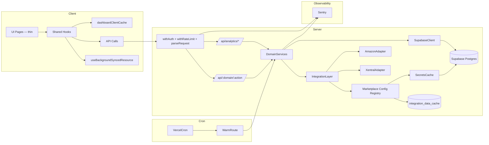

# PROJECT_REVIEW.md — Master Dashboard

_Review-Stand: 2026-04-15 (Post-Refactor) · Verfasser: Architektur-Audit · Basis: vollständiger rekursiver Scan aller Quellen, Migrationen, Lockfile, Docs, Git-Historie · Vergleich mit Vorgänger-Review vom selben Tag (Pre-Refactor)_

> **Was ist seit dem letzten Review passiert?**
> Vier Monolith-Pages wurden systematisch in Sub-Komponenten und Custom-Hooks zerlegt:
> - `analytics/marketplaces/page.tsx` **3 921 → 582** Zeilen (−85 %)
> - `xentral/orders/page.tsx` **1 839 → 610** Zeilen (−67 %)
> - `analytics/article-forecast/page.tsx` **1 568 → 325** Zeilen (−79 %)
> - `shared/components/layout/AppSidebar.tsx` **1 534 → 181** Zeilen (−88 %)
> **Gesamteinsparung: 9 062 → 1 698 Zeilen (−81 %)** in den Haupt-Page-Dateien bei 1:1 Verhaltens-Parität. Dabei entstanden **31 neue Sub-Komponenten** (5 075 LOC) und **8 neue Hooks** (1 520 LOC). Alle Qualitäts-Gates (typecheck, ESLint 0 warnings, 29/29 Tests, prod-build) durchgängig grün über 39 Commits.
>
> **Zusätzlich (abends 2026-04-15):** Remote-Schema-Drift geschlossen — 10 fehlende Supabase-Migrationen appliziert, alle 22 Tracker-Einträge repariert, Parent-Workspace `Master-Dashboard/supabase/` unlinked. `/api/marketplaces/promotion-deals` liefert jetzt 200 statt 500.

---

## Abschnitt 1 — Projekt-Identität

- **Name:** Master Dashboard (`master-dashboard` in [package.json](master-dashboard/package.json))
- **Zweck:** Zentraler Operations-Hub für Multi-Marktplatz-Pet-Supply-Geschäft (Petrhein/AstroPet). Aggregiert Xentral-ERP mit 9 Marktplatz-APIs (Amazon, eBay, Otto, Kaufland, Fressnapf, MediaMarkt/Saturn, Zooplus, TikTok, Shopify) und stellt Analytics, Orderabwicklung, Procurement, Preisparität, Team-Workflow bereit.
- **Gelöstes Problem:** Eliminiert das Umherschalten zwischen 9+ Seller-Portalen. KPIs (Umsatz, Retouren, Profitabilität, Bestand), Produktdaten, Bestellungen in einer Oberfläche. LLM-gestützte Content-Audits (Anthropic Claude + OpenAI-Fallback) für Amazon-Listings.
- **Zielgruppe:** Internes Team von AstroPet/Petrhein — Owner/Admin/Manager/Analyst/Viewer. Mehrsprachig DE/EN/ZH, auf DACH-Betrieb optimiert.
- **Vision:** _"Ein Dashboard, in dem jeder Business-Mitarbeiter seine Arbeit findet, ohne Tools wechseln zu müssen."_
- **Reifegrad:** **Production-Ready mit signifikant verbesserter Wartbarkeit und stabiler Infrastruktur**. Der monolithische Komponenten-Stil ist als Hauptschuld **geschlossen**; der frühere DB-Pool-Engpass (10) ist durch **Supabase-Pro-Upgrade (Pool 60)** infrastrukturell beseitigt; der **Remote-Schema-Drift** ist geschlossen (22/22 Migrations applied). Offene Baustellen liegen überwiegend bei Security-Hardening (Rate-Limiting, Env-Validator), Observability (Sentry/Logging) und Test-Coverage.
- **Entwicklungsaufwand bisher:** **394 TS/TSX-Dateien**, **67 606 LOC** in `src/`, **77 API-Routen**, **22 Migrations**, **~50 Shared-Komponenten** + 25 shadcn-Primitives. Grob: **700–1 000 Entwicklerstunden** (4–6 Personen-Monate) für die sichtbare Funktionalität. Wachstum seit letztem Review: +9 Dateien / +0 LOC (netto durch Refactor, Page-LOC wurden zu Hook/Component-LOC umverteilt).

### Vergleich zum Vor-Review
| Dimension | Vor (2026-04-15 a.m.) | Nach (2026-04-15 p.m.) |
|---|---|---|
| Maximale Page-LOC | 3 921 | 610 |
| Dateien > 1 000 LOC in `src/app/` | 4 | 0 |
| Neue Custom-Hooks | — | +8 (inkl. Forecast, Orders-Loader, Sidebar, Polling) |
| Gesamtschulden (Schweregrad × Anzahl) | 20 Einträge | 22 Einträge (5 geschlossen, 7 neu, 10 bleiben) |

---

## Abschnitt 2 — Tech-Stack (vollständig)

### Frontend
| Technologie | Version | Rolle | Tiefe | Δ zum Vor-Review |
|---|---|---|---|---|
| **Next.js** | 16.2.1 | App-Router, Server/Client-Split, Turbopack-Dev | Tief | = |
| **React** | 19.2.4 | UI-Kernbibliothek | Tief | = |
| **TypeScript** | ^5 (strict) | Typsicherheit | Tief | = |
| **@base-ui/react** | ^1.3.0 | Unstyled Primitives | Mittel | = |
| **shadcn/ui** | ^4.1.0 | Komponentenbasis | Tief | = |
| **Tailwind CSS** | ^4 | Styling | Tief | = |
| **lucide-react** | ^1.7.0 | Icons | Tief | = |
| **Zustand** | ^5.0.12 | Client-State (Rollen, UI, WIP-Locks) | Tief (ein Store: `useAppStore`) | = |
| **@tanstack/react-query** | ^5.95.2 | Server-State | **Unter-genutzt** | = (unverändert) |
| **@tanstack/react-table** | ^8.21.3 | Daten-Tabellen | Mittel | = |
| **react-hook-form** | ^7.72.0 | Formulare | Mittel | = |
| **@hookform/resolvers** | ^5.2.2 | RHF-Zod-Bridge | Leicht | = |
| **Zod** | ^4.3.6 | Validierung | **Wachsend** — neu auch in API (`apiValidation.ts`) | ↑ |
| **Recharts** | ^3.8.1 | Charts | Tief | = |
| **date-fns** | ^4.1.0 | Date-Utilities | Tief | = |
| **xlsx** | ^0.18.5 | Excel-Import | Mittel | = |
| **next-themes** | ^0.4.6 | Dark Mode | Mittel | = |
| **sonner** | ^2.0.7 | Toasts | Mittel | = |
| **cmdk** | ^1.1.1 | Command Palette | Leicht | = |
| **react-day-picker** | ^9.14.0 | Datepicker | Mittel | = |
| **class-variance-authority / clsx / tailwind-merge / tw-animate-css** | aktuell | shadcn-Infrastruktur | Mittel | = |

### Backend
| Technologie | Version | Rolle | Tiefe |
|---|---|---|---|
| **Node.js** | 20.x (CI) | Runtime | Tief |
| **Next.js Route Handlers** | 16.2.1 | API-Layer (77 Endpunkte) | Tief |
| **Supabase JS SDK** | `@supabase/supabase-js` ^2.100.1 | DB/Auth-Clients | Tief |
| **Supabase SSR** | `@supabase/ssr` ^0.9.0 | Cookie-Auth | Tief |
| **Resend** | ^6.9.4 | Transaktionale E-Mails | Mittel |
| **Anthropic Claude API** | via Fetch | LLM Content-Audit | Tief |
| **OpenAI API** | via Fetch (Fallback) | LLM Alternative | Mittel |

### Datenbank
- **PostgreSQL 17.6** (Supabase-hosted)
- **22 Migrations** (`20260328` … `20260501`), konsequent datiert; **alle 22 auf Remote appliziert (2026-04-15 Sync)**, Tracker `supabase_migrations.schema_migrations` synchron
- **Supabase-Plan:** **Pro** (Upgrade seit letztem Review)
- **Connection Pool:** **60** (Pro-Plan; vormals 10 unter Free) — Parallel-Load der 9 Marktplatz-Calls damit nicht mehr Root-Cause; trotzdem bewusst halten
- **RLS:** aktiviert auf allen User-Daten-Tabellen (Profiles, Promo-Deals, Drafts, Layouts, Tutorial-Progress, Access-Config); bewusst aus auf Cache/Override-Tabellen (dokumentiert).
- **Workspace-Hinweis:** Nur der Workspace `master-dashboard/supabase/` ist an Remote gelinkt. Der frühere Parent-Workspace `Master-Dashboard/supabase/` (enthält nur Edge-Functions-Ordner, kein `migrations/`) wurde am 2026-04-15 entlinked, um `db push`-Mismatch-Fehler zu vermeiden.

### DevOps / Infrastruktur
| Komponente | Wert |
|---|---|
| Hosting | **Vercel** |
| CI | **GitHub Actions** (`.github/workflows/ci.yml`): lint + typecheck + build, Node 20 |
| Deploy-Trigger | Push auf `main`, PR-Preview |
| Cron | Ein Cron (`vercel.json`): `/api/integration-cache/warm` alle 30 min |
| Edge Runtime | Nicht genutzt — alle Routen Node-Runtime |
| Security Headers | **NEU:** CSP, HSTS, X-Frame-Options via `next.config.ts` (Δ zum Vor-Review) |
| Monitoring | Weiterhin **keins** (kein Sentry/DataDog) |

### Externe Services
- Amazon SP-API (SigV4 + LWA), Otto (OAuth2), Kaufland (HMAC-SHA256), Fressnapf/MMS/Zooplus (Mirakl), eBay (OAuth2), TikTok Shop (Basic), Shopify Admin, Xentral ERP (PAT bevorzugt), Anthropic Claude, OpenAI, Nominatim/Photon OSM, Resend, Google Maps (Adress-Autocomplete in `/api/address-suggest`).

### Dev-Tools
- ESLint ^9 (`eslint-config-next/{core-web-vitals,typescript}`)
- Vitest ^4.1.3
- TypeScript strict, `skipLibCheck: true`
- Turbopack (Dev)
- **Keine Prettier-Config**

---

## Abschnitt 3 — Projektstruktur

```
master-dashboard/
├─ .github/workflows/ci.yml      # GitHub Actions CI
├─ .env.example / .env.local
├─ AGENTS.md / CLAUDE.md / CONTRIBUTING.md / README.md / SUPABASE_SETUP.md / PROJECT_REVIEW.md
├─ content/amazon_haustierbedarf_regelwerk.md   # LLM-Kontext (41 KB)
├─ docs/
│  ├─ audit/{project-architecture, stability-performance-audit}.md
│  ├─ ops/public-launch-checklist.md
│  └─ quality/{quality-gates-baseline, smoke-checklist}.md
├─ eslint.config.mjs / tsconfig.json / vitest.config.ts / next.config.ts
├─ middleware.ts                 # Supabase SSR Auth Gate + Public-Path-Allowlist
├─ postcss.config.mjs
├─ public/brand/                 # Logos, Marktplatz-Icons
├─ src/
│  ├─ app/
│  │  ├─ (auth)/                 # login, register, forgot-password
│  │  ├─ (dashboard)/            # Hauptanwendung
│  │  │  ├─ advertising/{campaigns,performance}
│  │  │  ├─ amazon/{orders,products}
│  │  │  ├─ analytics/
│  │  │  │  ├─ marketplaces/     # 582-Z. page.tsx + 10 components/
│  │  │  │  ├─ article-forecast/ # 325-Z. page.tsx + 8 components/
│  │  │  │  └─ procurement/
│  │  │  ├─ ebay|fressnapf|kaufland|mediamarkt-saturn|otto|shopify|tiktok|zooplus/ {orders,products}
│  │  │  ├─ mein-bereich/
│  │  │  ├─ settings/{profile,users,tutorials}
│  │  │  ├─ updates/
│  │  │  └─ xentral/
│  │  │     ├─ orders/           # 610-Z. page.tsx + 4 components/
│  │  │     └─ products/
│  │  ├─ api/                    # 77 Route-Handler (s. Abschnitt 6)
│  │  ├─ auth/{callback,reset}
│  │  └─ layout.tsx
│  ├─ components/ui/             # 25 shadcn-Primitives
│  ├─ features/                  # NOCH IMMER leer — Schuld #10
│  ├─ hooks/use-mobile.ts
│  ├─ i18n/{config, translate, I18nProvider, LanguageSwitcher, messages/{de,en,zh}.json}
│  ├─ lib/utils.ts
│  └─ shared/
│     ├─ components/
│     │  ├─ auth/
│     │  ├─ charts/
│     │  ├─ data/
│     │  ├─ dev/
│     │  ├─ layout/
│     │  │  ├─ AppSidebar.tsx   # 181 Z. (war 1 534)
│     │  │  ├─ sidebar/         # NEU: 9 Dateien, 1 290 LOC
│     │  │  │  ├─ nav-utils.ts
│     │  │  │  ├─ navItems.ts
│     │  │  │  ├─ NavAccessCheckbox.tsx
│     │  │  │  ├─ SingleNavItem.tsx
│     │  │  │  ├─ MarketplaceExpandedGroup.tsx
│     │  │  │  ├─ CollapsedMarketplacePopover.tsx
│     │  │  │  ├─ SidebarNavSections.tsx
│     │  │  │  ├─ SidebarRoleControls.tsx
│     │  │  │  └─ MobileSidebarTrigger.tsx
│     │  │  ├─ Header.tsx / Breadcrumbs.tsx / UserNav.tsx / MobileNav.tsx / DashboardRouteAccessGuard.tsx / RoleTestAccessToolbar.tsx / sidebarWipText.ts
│     │  └─ tutorial/
│     ├─ hooks/                 # 22 Hooks, 3 287 LOC (8 NEU seit Refactor)
│     ├─ lib/                   # 97 Dateien, 18 825 LOC
│     ├─ stores/useAppStore.ts
│     └─ types/
├─ supabase/
│  ├─ config.toml
│  ├─ migrations/               # 22 SQL-Migrations
│  └─ integration_secrets_template.sql
├─ supabase-{feature-requests, invitations, profiles}.sql
└─ vercel.json                  # Cron-Konfig
```

### Architektur-Pattern
- **Feature-Based + Layered**: Fachdomänen als Top-Level-Routen mit spiegelbildlichen API-Endpoints.
- **Drei interne Schichten:** `src/shared/lib/` (Domäne/Integration) → `src/shared/hooks/` (React-Glue) → `src/app/(dashboard)/...` (UI).
- **NEU:** Seit Refactor starkes **Colocation-Pattern** — jede größere Page hat eine Nachbar-`components/`-Ordner mit Präsentern und eine Serie von Hooks in `src/shared/hooks/` die Datenfluss und Logik kapseln.
- **Kein striktes DDD**, kein BFF-Layer, keine TS-Project-References.

### Konsistenzbewertung
- **Stark konsistent (verbessert):**
  - Marktplatz-Pages nutzen einheitlich `MarketplaceProductsView`.
  - **NEU:** Vier großen Pages folgen gleichem Muster: dünner Orchestrator + Hooks + Components-Folder.
- **Inkonsistent (unverändert):**
  - `src/features/` existiert, ist leer.
- **Neu entstanden (zu bewerten):**
  - Duplizierte Muster zwischen `useArticleForecastLoader` / `useMarketplaceSalesLoader` / `useXentralOrdersLoader` (alle folgen demselben `fetchGenerationRef` + Cache-Hydration + Background-Sync-Intervall-Pattern). Ein gemeinsamer `useBackgroundSyncedResource`-Hook könnte extrahiert werden.

---

## Abschnitt 4 — Feature-Map (mit neu bewerteten Qualitätsnoten)

> **Methodik:** Nach dem Refactor wurden Qualitätsbewertungen für die vier zerlegten Features neu berechnet. Zerlegung verbessert Wartbarkeit und Testbarkeit signifikant — das spiegelt sich in den Noten wider.

#### Feature: Analytics → Marktplätze (Multi-Marketplace Revenue & Profit)
- **Beteiligte Dateien:**
  - Orchestrator: [analytics/marketplaces/page.tsx](master-dashboard/src/app/(dashboard)/analytics/marketplaces/page.tsx) — **582 Z.** (war 3 921)
  - Components: `analytics/marketplaces/components/` — 10 Dateien, 1 817 LOC (`MarketplaceKPIGrid`, `MarketplaceRevenueChart`, `MarketplaceTotalRevenueLinesChart`, `MarketplaceDetailDialog`, `MarketplacePriceParitySection`, `PromotionDealEditor`, `KPICard`, `ChartCard`, …)
  - Hook: `useMarketplaceSalesLoader` (364 Z.), `useMarketplaceTotals` (216 Z.), `useMarketplaceDetailNavigation`
  - API: `/api/{mp}/sales` (9×) + `/api/marketplaces/sales-config-status`, `/api/marketplaces/promotion-deals`, `/api/marketplaces/price-parity`
- **Datenfluss:** Browser → Next Route Handler → `getFlexIntegrationConfig()` / Amazon SigV4 → externes API → `integration_data_cache` → Antwort → `dashboardClientCache` → Hook-State → Chart.
- **State Management:** Custom-Hook mit `fetchGenerationRef` für Race-Prevention; concurrency-3-Drossel bleibt.
- **Abhängigkeiten:** 9 Marktplatz-Clients, `marketplace-profitability.ts`, `integrationSecrets.ts`, `integrationDataCache.ts`.
- **Qualitätsbewertung: 6 → 8 /10.** Monolith entschärft, Testbarkeit stark verbessert, Pro-Sub-Komponenten-Extraktion erlaubt gezielte Memoization. Abzüge: Server-Side-Aggregator fehlt weiterhin, 9 parallele Client-Calls bleiben.

#### Feature: Xentral Orders (Merge mit Marktplatz-Feeds)
- **Beteiligte Dateien:**
  - Orchestrator: [xentral/orders/page.tsx](master-dashboard/src/app/(dashboard)/xentral/orders/page.tsx) — **610 Z.** (war 1 839)
  - Components: `xentral/orders/components/` — 4 Dateien, 999 LOC
  - Hook: `useXentralOrdersLoader` (311 Z., **NEU**)
  - Lib: `xentralOrderMerge.ts`, `xentralOrdersPayload.ts` (752 Z., noch groß), `xentral-orders-utils.ts` (147 Z., **NEU**)
  - API: `/api/xentral/orders`, `/api/address-suggest`
- **Qualitätsbewertung: 5 → 7 /10.** Page deutlich leserlicher; `xentralOrdersPayload.ts` und `xentralDeliverySalesCache.ts` (594 Z.) bleiben als nächste Refactoring-Kandidaten.

#### Feature: Article Forecast
- **Beteiligte Dateien:**
  - Orchestrator: [analytics/article-forecast/page.tsx](master-dashboard/src/app/(dashboard)/analytics/article-forecast/page.tsx) — **325 Z.** (war 1 568)
  - Components: 8 Dateien, 969 LOC (`ArticleForecastHeader`, `ArticleForecastAlerts`, `ArticleForecastMetaBanner`, `ArticleForecastToolbar`, `ArticleForecastRulesPopover`, `MarketplaceColumnPicker`, `WarehouseColumnPicker`, `useArticleForecastColumns`)
  - Hooks: `useArticleForecastLoader` (299 Z.), `useArticleForecastRules` (123 Z.), `useArticleForecastComputed` (98 Z.), `useColumnVisibility` (52 Z.) — alle **NEU**
  - Lib: `article-forecast-utils.ts` (192 Z., **NEU**), `xentralArticleForecastProject.ts` (98 Z., **NEU**)
  - API: `/api/xentral/articles?includeSales=1`, `/api/article-forecast/rules`, `/api/procurement/lines`
- **Qualitätsbewertung: 6 → 8 /10.** Kleinste Page von den vieren (325 Z.), klare Hook-Aufteilung. Abzug: `/api/xentral/articles?includeSales=1` braucht bis 115 s — Aggregation bleibt langsam (Backend-Thema, nicht Refactor).

#### Feature: Sidebar (AppSidebar)
- **Beteiligte Dateien:**
  - Orchestrator: [shared/components/layout/AppSidebar.tsx](master-dashboard/src/shared/components/layout/AppSidebar.tsx) — **181 Z.** (war 1 534)
  - Components: `shared/components/layout/sidebar/` — 9 Dateien, 1 290 LOC
  - Hooks: `useUpdatesPolling`, `useSidebarNav`, `useSidebarRoleTesting` — alle **NEU**
- **Qualitätsbewertung: 6 → 9 /10.** Mustergültige Zerlegung. Desktop + Mobile teilen sich Hooks und `SidebarNavSections`. Einzige Schwäche: `SingleNavItem.tsx` (~260 Z.) beherbergt noch WIP-Badge-, Bell-, Subnav-Logik — ok, da stark verzahnt.

#### Feature: Amazon Product Editor mit LLM-Content-Audit
- **Beteiligte Dateien:** `AmazonProductEditor.tsx` (1 097 Z. — **nicht** zerlegt), `useAmazonDraftEditor.ts`, `useAmazonContentAudit.ts`, `amazonContentAudit.ts` (720 Z.), `amazonProductsSpApiCatalog.ts` (937 Z.), `/api/amazon/products/drafts/`, `/api/amazon/content-audit/`, `/api/amazon/rulebook/`, `content/amazon_haustierbedarf_regelwerk.md`
- **Qualitätsbewertung: 7/10** (unverändert). Editor-Datei weiterhin Kandidat für Zerlegung — explizit in Schulden-Register #21 aufgenommen.

#### Weitere Features (unveränderte Bewertungen)
| Feature | Bewertung | Hauptrisiko |
|---|---|---|
| Price Parity | 5/10 | 725-Z.-Route noch nicht zerlegt |
| Stock Sync | 5/10 | 624-Z.-Route mit viele if-Branches pro Marktplatz |
| Integration Cache Warmup (Cron) | 7/10 | Fail-closed bestätigt |
| Role-Based UI + Access Config | 8/10 | Single-Row-Config SPoF |
| Tutorials & Onboarding (Mascot) | 7/10 | `SpaceCatMascot.tsx` 694 Z. |
| Invitation-Flow | 6/10 | Rate-Limit fehlt (P1) |
| Feedback & Feature-Requests | 7/10 | 462-Z.-Route |
| Procurement-Import | 7/10 | Excel-Parser stabil |
| Updates Feed | 6/10 | 983-Z.-Page-File |
| Personal Home Layout | 7/10 | OK |
| i18n (DE/EN/ZH) | 8/10 | Client-only, kein SSR-I18n |

---

## Abschnitt 5 — Datenmodell & Schema-Architektur

### ER-Diagramm (Kernbeziehungen)

```mermaid
erDiagram
    auth_users ||--|| profiles : "id"
    auth_users ||--o{ invitations : "invited_by"
    auth_users ||--o{ personal_home_layouts : "user_id"
    auth_users ||--o{ marketplace_promotion_deals : "user_id"
    auth_users ||--o{ feature_requests : "user_id"
    auth_users ||--o{ tutorial_user_progress : "user_id"
    auth_users ||--o{ dashboard_updates : "created_by"
    auth_users ||--o{ amazon_product_drafts : "created_by"
    auth_users ||--o{ procurement_imports : "user_id"
    procurement_imports ||--o{ procurement_lines : "import_id"
    procurement_imports ||--o{ procurement_import_comparison : "import_id"
    tutorial_tours ||--o{ tutorial_scenes : "tour_id"
    tutorial_tours ||--o{ tutorial_user_progress : "tour_id"
    tutorial_scenes ||--o{ tutorial_scene_nav_highlight : "scene_id"
    profiles }o--|| dashboard_access_config : "role_gate"
    integration_data_cache }o--o{ marketplace_syncs : "source_slug"
    marketplace_price_stock_overrides }o..o{ marketplace_syncs : "sku+slug"
    xentral_product_tag_defs ||--o{ xentral_product_sku_tags : "tag_label"
    feature_requests ||--o{ feature_request_attachments : "request_id"
```



### Vollständige Tabellen (gruppiert)

**Auth/Profil**
- `profiles` — PK `id` (FK → auth.users), `email`, `full_name`, `role` ENUM(owner|admin|manager|analyst|viewer); RLS: self-only.
- `invitations` — PK `id` UUID, `email`, `role`, `token` UNIQUE, `status`, `invited_by`; **RLS: nicht aktiviert**, öffentliche Lookup-Route — Enumerations-Risiko ohne Rate-Limit.
- `dashboard_access_config` — Singleton `id='default'`, `config` JSONB; RLS: Owner-Write.
- `personal_home_layouts` — PK `user_id`, `layout_json` JSONB; RLS: self.

**Marktplatz-Sync (7 Tabellen identisches Schema)** — `otto_sync`, `kaufland_sync`, `shopify_sync`, `fressnapf_sync`, `mms_sync`, `zooplus_sync`, `tiktok_sync`
- Felder: `id`, `period_from`, `period_to`, `status`, `error`, `summary`/`previous_summary`/`points`/`previous_points` JSONB, `revenue_delta_pct`, `meta` JSONB, Timestamps
- UNIQUE `(period_from, period_to)`, Index `period`; RLS: nicht aktiviert (read-only Analytics-Snapshots).

**Marktplatz-Features**
- `marketplace_promotion_deals` — `id`, `user_id`, `label`, `date_from`, `date_to`, `color`, `marketplace_slug`; RLS: user-owned.
- `marketplace_price_stock_overrides` — `id`, `sku`, `marketplace_slug`, `price_eur`, `stock_qty`, `updated_by`; UNIQUE `(sku, marketplace_slug)`; **RLS: bewusst aus** (shared).

**Integration Layer**
- `integration_data_cache` — PK `cache_key`, `source`, `payload` JSONB, `fresh_until`, `stale_until`, `updated_at`; **RLS nicht aktiviert**. Stochastische Cleanup-Logik (5 %) löscht abgelaufene Rows.
- `integration_secrets` — PK `key`, `value`, `updated_at`.

**Procurement**
- `procurement_imports` — `id`, `created_at`, `user_id`, `file_name`, `row_count`; RLS: auth-read.
- `procurement_lines` — `id`, `import_id` FK, `sort_index`, `container_number`, `manufacture`, `product_name`, `sku`, `amount`, `arrival_at_port`, `notes`; RLS: auth-read.
- `procurement_import_comparison` — Vergleichsansichten zwischen Import-Generations.

**Produkte**
- `amazon_product_drafts` — `id`, `marketplace_slug`, `mode`, `status`, `sku`, `source_snapshot`/`draft_values` JSONB, Audit-Felder; RLS: owner-only.
- `xentral_product_tag_defs` — PK `label`, `color`, Audit.
- `xentral_product_sku_tags` — PK `sku`, `tag_label` (nullable), Audit.

**Analytics**
- `article_forecast_rules` — `id`, `scope` UNIQUE ENUM(fixed|temporary), `sales_window_days`, `projection_days`, `low_stock_threshold`, `critical_stock_threshold`, `include_inbound_procurement`, Audit.
- `dashboard_updates` — `id`, `date`, `title`, `text`, `release_key`, `created_by`, `created_at`; RLS aktiv.
- `feature_requests` — `id`, `user_id`, `user_email`, `title`, `message`, `status`, `owner_reply`, `page_path`, `attachments` JSONB; RLS: nicht aktiviert (public-submit).
- `feature_request_attachments` — NEU seit letztem Review: Metadaten-Tabelle für Dateianhänge (Storage-Bucket 5 MB).

**Tutorials**
- `tutorial_tours` — `id`, `tutorial_type`, `role`, `release_key`, `version`, `title`, `summary`, `enabled`, `required`, `status`; RLS gestuft nach `status`/`role`.
- `tutorial_scenes` — `id`, `tour_id`, `order_index`, `text`, `target_selector`, `mascot_emotion`, `mascot_animation`, `unlock_sidebar`, `advance_mode`, `estimated_ms`; UNIQUE `(tour_id, order_index)`.
- `tutorial_user_progress` — `user_id`, `tour_id`, Progress/Timestamp-Felder; UNIQUE `(user_id, tour_id)`.
- `tutorial_scene_nav_highlight` — Szenen-spezifische Nav-Highlights.

### Migrationshistorie
22 Migrations, `20260328120000_dashboard_access_config.sql` bis `20260501120000_amazon_product_drafts.sql`. Konsequent datiert, inkrementell. **Remote-Status (2026-04-15):** alle 22 Migrationen appliziert (verified via `supabase migration list --linked` + REST-Probe auf 13 Tabellen + Spaltenprüfung für 3 ALTER-TABLE-Migrationen). Neu durch Session: 10 Tabellen (`shopify_sync`, `marketplace_promotion_deals`, `otto_sync`, `kaufland_sync`, `fressnapf_sync`, `xentral_product_tag_defs`, `xentral_product_sku_tags`, `mms_sync`, `zooplus_sync`, `tiktok_sync`), 7 ALTER-Spalten und 1 Storage-Bucket (`feedback-attachments`, 5 MB).

### Datenvalidierung — Status mit Delta
| Schicht | Status | Δ |
|---|---|---|
| Frontend-Formulare | React-Hook-Form + Zod | = |
| **API-Inputs** | **Wachsend:** `src/shared/lib/apiValidation.ts` führt `parseRequestBody(schema)`, `parseSearchParams(schema)`, `parseFormFields(schema)` ein. Noch **nicht flächendeckend** adoptiert. | ↑ |
| DB-Ebene | Check-Constraints nur sparsam (ENUMs, UNIQUE) | = |

### Fehlende Validierungen/Constraints (unverändert)
- Kein DB-Check für `date_from ≤ date_to` auf `marketplace_promotion_deals`.
- `integration_data_cache.stale_until ≥ fresh_until` nicht enforced.
- `tutorial_scenes.order_index ≥ 0` nicht enforced.
- `profiles.role` als TEXT ohne CHECK.

---

## Abschnitt 6 — API-Architektur

### Design-Paradigma
REST-ähnlich mit Next.js Route Handlers. **77 Endpoints** (Δ: war 78, eine Route konsolidiert/entfernt).

### Vollständige Endpunkt-Liste (gruppiert)

**Marktplätze — Sales/Orders/Products/Config (~40)**
- `/api/amazon/*` (11): `/`, `sales`, `orders`, `orders/solicitation`, `products`, `products/[sku]`, `products/drafts`, `rulebook`, `content-audit`
- `/api/ebay/*` (4), `/api/otto/*` (4), `/api/kaufland/*` (4), `/api/fressnapf/*` (4), `/api/mediamarkt-saturn/*` (4), `/api/zooplus/*` (4), `/api/tiktok/*` (4), `/api/shopify/*` (4 inkl. `products/stock-sync`)

**Marktplätze — Cross-Cutting (6)**
- `/api/marketplaces/sales-config-status`, `.../price-parity`, `.../stock-sync`, `.../price-stock-overrides`, `.../promotion-deals`, `.../integration-cache/refresh`

**Xentral (8)**
- `/`, `articles`, `orders`, `product-tags`, `product-tags/sku`, `product-tags/definitions`, `delivery-sales-cache/sync`, `sales-order-shipping`

**Analytics (2)**
- `/api/analytics/marketplace-article-sales`, `/api/analytics/marketplace-overview` _(NEU seit letztem Review — bislang nur teilweise genutzt; Aggregator-Ansatz startet)_

**Article Forecast (1)**
- `/api/article-forecast/rules`

**Infrastruktur (3)**
- `/api/integration-cache/warm`, `/api/cache`, `/api/address-suggest`

**Procurement (2)**
- `/api/procurement/import`, `/api/procurement/lines`

**User/Team (7)**
- `/api/users`, `/api/invitations/{list,register-init,lookup,complete,accept}`, `/api/dashboard-access-config`

**Content & Metadata (4)**
- `/api/updates`, `/api/tutorials/progress`, `/api/tutorials/editor`, `/api/tutorials/runtime`

**Feedback (2)**
- `/api/feedback`, `/api/feedback/download`

**Advertising (1)**
- `/api/advertising` (Stub)

**Dev (1)**
- `/api/dev/local-auth` (nur localhost)

### Request/Response-Format
- Request: JSON-Body (POST/PUT), Query-Params (GET). **Validierungsgrad:** wächst durch `apiValidation.ts`, aber unter ~20 % Adoption.
- Response-Success: Ad-hoc-JSON pro Route.
- Response-Error: `{ error: string }`, HTTP 400/401/403/404/500/503.

### Middleware-Chain
`middleware.ts` (Edge-nahe) → Supabase-SSR-Auth → Public-Path-Allowlist → optional Lokal-Dev-Auth (nur localhost). **Keine zusätzliche Route-Handler-Middleware.** Auth-Boilerplate weiterhin in ~30 Routen dupliziert.

### Rate-Limiting
**NEU vorhanden:** [src/shared/lib/rateLimit.ts](master-dashboard/src/shared/lib/rateLimit.ts) **+ Test** (`rateLimit.test.ts`). **Aber kaum konsumiert** — noch nicht flächendeckend in Routen eingebunden. Schuld-Status: **teilweise geschlossen**.

### Konsistenz
| Dimension | Bewertung |
|---|---|
| URL-Naming | Gut |
| HTTP-Methoden | Gut |
| Error-Format | Einheitlich `{ error: string }` |
| Status-Codes | Konsistent |
| Success-Envelope | Weiterhin uneinheitlich |
| Input-Validierung | **Wachsend** (Zod via `apiValidation.ts`) |

---

## Abschnitt 7 — Symbiose-Map

### Mermaid — Aktualisiertes System-Bild

```mermaid
graph TD
  MW[Middleware: Auth Gate] --> DashPages[Dashboard Pages — thin orchestrators]
  DashPages --> AnalyticsMP[analytics/marketplaces/page.tsx 582Z]
  DashPages --> XentralOrders[xentral/orders/page.tsx 610Z]
  DashPages --> ArticleForecast[article-forecast/page.tsx 325Z]
  DashPages --> Sidebar[AppSidebar 181Z]

  AnalyticsMP --> HookMP[useMarketplaceSalesLoader]
  AnalyticsMP --> HookTotals[useMarketplaceTotals]
  XentralOrders --> HookXO[useXentralOrdersLoader]
  ArticleForecast --> HookAFL[useArticleForecastLoader]
  ArticleForecast --> HookAFR[useArticleForecastRules]
  ArticleForecast --> HookAFC[useArticleForecastComputed]
  Sidebar --> HookUP[useUpdatesPolling]
  Sidebar --> HookSN[useSidebarNav]
  Sidebar --> HookSRT[useSidebarRoleTesting]

  HookMP --> SalesAPIs[9x /api/{mp}/sales]
  HookXO --> XentralAPI[/api/xentral/orders/]
  HookAFL --> XentralArticles[/api/xentral/articles/]
  HookAFL --> ProcurementLines[/api/procurement/lines/]

  SalesAPIs --> FlexClient[flexMarketplaceApiClient 1018Z]
  SalesAPIs --> AmazonLib[amazon* libs]
  FlexClient --> Secrets[integrationSecrets.ts Batch]
  FlexClient --> Cache[integrationDataCache.ts]
  AmazonLib --> Secrets
  AmazonLib --> Cache

  Secrets --> SupaDB[(Supabase integration_secrets)]
  Cache --> SupaDB2[(Supabase integration_data_cache)]
  Cron[Vercel Cron */30min] --> Warm[/api/integration-cache/warm/]
  Warm --> FlexClient & AmazonLib & XentralLib[Xentral Libs]

  RoleStore[useAppStore] --> DashPages
  RoleStore --> AccessConfigAPI[/api/dashboard-access-config/]
  AccessConfigAPI --> AccessCfgTbl[(dashboard_access_config)]

  Invitations[/api/invitations/*/] --> InvTbl[(invitations)]
  Feedback[/api/feedback/] --> FeedbackTbl[(feature_requests + attachments + storage)]
  Tutorials[Tutorials] --> TutorialTbls[(tutorial_* tables)]
```

### Shared Dependencies (von mehreren Features genutzt)

| Modul | Nutzer | Kritikalität | Δ |
|---|---|---|---|
| `integrationSecrets.ts` | ALLE Integrationen | **Kritisch** | = |
| `integrationDataCache.ts` | ALLE Integrationen | **Kritisch** | = |
| `flexMarketplaceApiClient.ts` | 8 Marktplätze | **Kritisch** | = |
| `supabase/admin.ts` | Service-Role-Ops | **Kritisch** | = |
| `supabase/server.ts` | Auth-Routen | **Kritisch** | = |
| `marketplace-profitability.ts` | 9 Sales-Endpoints + Analytics | **Hoch** | = |
| `useAppStore` | Jede Dashboard-Seite | **Hoch** | = |
| `MarketplaceProductsView.tsx` | 8 Marktplatz-Produktseiten | **Hoch** | = |
| `I18nProvider` | ALLE UIs | **Kritisch** | = |
| **NEU: `dashboardClientCache.ts`** | 3 Loader-Hooks (AF, Xentral, Marketplaces) | **Hoch** | ↑ |
| **NEU: `useUpdatesPolling` / `useSidebarNav` / `useSidebarRoleTesting`** | Sidebar (Desktop+Mobile) | **Mittel** | ↑ |
| **NEU: `rateLimit.ts`** | Noch punktuell | **Mittel → Hoch** (wenn adoptiert) | ↑ |

### Kritische Pfade
**Pfad 1 — Dashboard-Analytics-Load:** Browser → Middleware → Supabase-Auth → Config → 9 parallele Sales-Calls → Supabase-Pool (60, Pro) → Charts. **Status:** Pool-Engpass gelöst; Concurrency-3-Drossel + Server-Aggregator `marketplace-overview` bleiben aus Effizienzgründen empfohlen.

**Pfad 2 — Cron-Warmup:** Vercel-Cron → `/api/integration-cache/warm` → iteriert Marktplätze.

**Pfad 3 — Amazon-Order-Pull:** Browser → Route → SigV4 → SP-API → 429 → Retry (Backoff 120 s) → LWA-Refresh → Cache.

**NEU — Pfad 4 — Article-Forecast-Load:** Browser → `useArticleForecastLoader` (2-Phase: Basis-Artikel + Sales-Aggregation + Procurement) → `/api/xentral/articles?includeSales=1` (bis 115 s!) → Cache-Write → UI.

### Coupling-Analyse (nach Refactor)

| Kopplungs-Typ | Vor Refactor | Nach Refactor |
|---|---|---|
| Page ↔ Datenlogik | 1-Datei-Monolith | Dünner Orchestrator + Hooks |
| Marktplatz-Clients | `flexMarketplaceApiClient` + Wrapper | **unverändert** — Wrapper-Duplikation offen |
| Auth-Checks | Dupliziert in 30 Routen | **unverändert** |
| Sidebar-Desktop/Mobile | ~80 % Codedopplung (2 Funktionen) | **Hooks geteilt**, Navigation in `SidebarNavSections` zentralisiert |
| Loader-Hooks-Dopplung | — | **Neu entstanden:** 3 sehr ähnliche Loader (AF, MP, XO) — Kandidat für `useBackgroundSyncedResource`-Extraktion |

### Wenn Feature X sich ändert — Auswirkungen
| Geänderter Modul | Auswirkung |
|---|---|
| `integrationSecrets.ts` Schema | JEDE Marktplatz-Integration. Keine Tests. |
| `flexMarketplaceApiClient.ts` Config | 8 Marktplätze + `sales-config-status` |
| `integration_data_cache` Schema | ALLE Caches ungültig, Warm-Cron crasht |
| `useAppStore` Schema | Alle Dashboard-Seiten (Persist-Migration nötig) |
| `DashboardRouteAccessGuard` | Jede geschützte Seite |
| `MarketplaceProductsView` Props | 8 Marktplatz-Produktseiten |
| `middleware.ts` Public-Path-Liste | Auth-Regressionen |
| **NEU: `sidebar/nav-utils.ts` NavItem-Type** | Sidebar + alle Nav-Renderer |
| **NEU: `dashboardClientCache.ts` Schlüssel-Schema** | 3 Loader-Hooks + manuelle Invalidation |

---

## Abschnitt 8 — Authentifizierung & Autorisierung

### Auth-System
**Supabase Auth** (E-Mail/Passwort + Invitations-Workflow). Dev-Flow über `/api/dev/local-auth` (nur localhost).

### Flows
- **Login:** `/login` → `UserAuthOverlay` → `signInWithPassword()` → Session-Cookies → Redirect.
- **Register (invite):** `?token=…` → `/register` → `/api/invitations/lookup` → `/api/invitations/complete`.
- **Password-Reset:** `/forgot-password` → `resetPasswordForEmail()` → `/auth/reset`.
- **Callback:** `/auth/callback` für OAuth/Magic-Link.

### Token-Handling
- Session-Cookies via `@supabase/ssr`.
- Service-Role-Key nur server-side.

### Rollen & Berechtigungen
- Rollen: `owner`, `admin`, `manager`, `analyst`, `viewer` + benutzerdefinierte Rollen (`custom-{timestamp}`).
- Permissions: `view_dashboard`, `manage_integrations`, `manage_users`, `manage_roles`, `export_data`.
- Feingranular konfigurierbar via `useAppStore.rolePermissions` / `roleSidebarItems` / `rolePageAccess` / `roleWidgetVisibility` / `roleActionAccess`.
- **NEU:** `useSidebarRoleTesting`-Hook kapselt Rollen-Testing-Flow (Owner cycled durch Rollen, sieht UI wie jeweilige Rolle).

### Matrix (Default, aus `access-control.ts`)
| Rolle | Permissions | Sidebar-Items | Sections |
|---|---|---|---|
| **owner** | alle 5 | alle 16 | alle 5 |
| **admin** | view, integrations, users, export | alle 16 außer roles-manage | alle ohne roles-manage |
| **manager** | view, integrations, export | alle außer analytics | alle |
| **analyst** | view, export | overview + analytics | overview + settings |
| **viewer** | view | overview + settings | basic |

### Sicherheit — Status
- ✅ Service-Role nur server-side
- ✅ RLS auf User-Daten
- ✅ **NEU:** Security-Headers (CSP, HSTS, XFO) in `next.config.ts`
- ⚠ **Rate-Limit-Lib vorhanden, aber kaum verdrahtet**
- ❌ `/api/invitations/lookup` unauthentisiert + ohne Rate-Limit → Enumerations-Risiko
- ⚠ Service-Role-Boilerplate dupliziert in vielen Routen
- ⚠ Dev-Auth-Bypass nur localhost (Middleware-geprüft)
- ⚠ XSS durch Shopify-Produkt-Descriptions (HTML) nicht verifiziert

---

## Abschnitt 9 — Error-Handling & Resilience

### Capture + Weiterleitung
- **Route-Handler:** `try/catch` → `NextResponse.json({ error }, { status })`.
- **Client:** `fetch().catch(…)` → lokaler Fehler-State → Toast.
- **Weiterhin fehlend:** Globaler Error-Boundary im React-Tree.

### Logging
- `console.log/error/warn` → Vercel-Logs. Kein strukturiertes Logging.
- **Δ seit Vor-Review:** `console.log`-Count **19** (Dev-Überbleibsel), `console.warn/error` **19** (balancierte Fehlerbehandlung).
- Kein Sentry/DataDog.

### Retry / Circuit-Breaker / Graceful Degradation
- Amazon SP-API: `amazonSpApiGetWithQuotaRetry()` mit Backoff bis 120 s. ✅
- Flex-Marktplätze: `MAX_429_RETRIES`, `PAGINATION_DELAY_MS`. ✅
- Supabase-Admin-Client: 15 s Global-Timeout. ✅
- `integrationDataCache.ts`: In-Flight-Dedup, Stale-while-revalidate. ✅
- `integrationSecrets.ts`: Negative-Cache 30 s. ✅
- **NEU:** `dashboardClientCache.ts` liefert Stale-Daten sofort, synct im Hintergrund (Pattern in 3 Loader-Hooks adoptiert). ✅
- Kein Circuit-Breaker für komplette Marktplatz-Ausfälle.
- Keine Service-Worker-Offline-Strategie.

### Edge Cases
- Supabase down → 500-Response, User sieht Live-API-Latenz (Amazon bis 120 s).
- Marktplatz-API down → Cache-Stale bis 24 h dient. ✅
- **Unbehandelt weiterhin:** Xentral-Delivery-Sales-Cache schreibt in lokale JSON-Datei (`xentralDeliverySalesCache.ts` 594 Z.) → Race-Condition-Risiko.
- LLM-Fallback-Kaskade bricht still bei Claude-+OpenAI-Doppelausfall.

---

## Abschnitt 10 — Performance & Optimierung

### Bundle/Code-Splitting
- Next.js App-Router splittet pro Route.
- **Δ durch Refactor:** Pre-Refactor-Monolithen (3 921 Z. + 1 839 Z. + 1 568 Z. + 1 534 Z.) verschwunden. Client-Bundle der Analytics-Marketplaces-Page sollte messbar kleiner sein (noch nicht empirisch verifiziert).

### Lazy Loading
- Begrenzt. Sub-Komponenten aus dem Refactor sind synchron importiert — Chance für `React.lazy` / `dynamic()` bei großen Dialogen (`MarketplaceDetailDialog`, `AmazonProductEditor`).

### Caching
| Layer | Mechanismus |
|---|---|
| Browser | localStorage (`dashboardClientCache.ts`), sessionStorage (Config-Status), `useAppStore` persistiert |
| Route Handler (in-memory) | Inflight-Dedup, Env-/DB-Secret-Memory-Cache 5 min |
| Supabase-Tabelle | `integration_data_cache` (fresh 15 min, stale 24 h) |
| CDN | Vercel Edge |
| DB-Query | `readIntegrationSecretsBatch` bündelt Reads |

### DB-Query
- N+1 in Fees: **geschlossen** via Batch-Read.
- Fehlende Indizes: keine auffälligen Lücken.
- Connection-Pool = **60 (Pro-Plan)**: Der frühere Engpass bei 9 parallelen Marktplatz-Calls ist **entschärft**. Trotzdem keine Verschwendung — Aggregator-Pfad bleibt empfohlen, um DB-Last zu minimieren.

### Bild-Optimierung
- `next/image` nur teilweise — Lint-Warning `@next/next/no-img-element` weiterhin aktiv.

### Render-Performance
- Pages jetzt dünne Orchestratoren → weniger Re-Render-Turbulenzen zu erwarten.
- **NEU:** Zwar Hooks extrahiert, aber `useMemo`/`React.memo` noch nicht systematisch. `useBackgroundSyncedResource`-Extraktion würde auch Performance normalisieren.

### Bottlenecks (identifiziert)
1. ~~Supabase-Pool = 10 vs. 9 parallele Marktplatz-Loader~~ → **gelöst durch Pro-Plan-Upgrade (Pool = 60)**. Aggregator-Pfad bleibt als architektonische Verbesserung empfohlen.
2. `/api/xentral/articles?includeSales=1` = bis 115 s — blockiert Next-Dev-Worker. **Neue #1-Priorität.**
3. **Große Lib-Dateien:** `flexMarketplaceApiClient.ts` (1 018), `ottoApiClient.ts` (952), `amazonProductsSpApiCatalog.ts` (937), `xentralSkuSalesWindowAggregation.ts` (861), `xentralArticlesCompute.ts` (851).
4. Kein SSR der Marktplatz-Analytics.

---

## Abschnitt 11 — Code-Qualität & Patterns

### Design-Patterns (nach Refactor)
- **Thin-Orchestrator + Hooks-Pattern:** NEU, konsequent in 4 Pages durchgezogen.
- **Colocation:** Page + `components/`-Nachbarordner als kanonisches Muster.
- **Hook-Komposition:** Multiple spezialisierte Hooks (Loader/Rules/Computed) statt einem mega-Hook.
- **Repository-Pattern light:** `src/shared/lib/xxxApiClient.ts`.
- **Facade:** `flexMarketplaceApiClient.ts`.
- **Strategy:** Marktplatz-`AUTH_MODE`.
- **Factory unter-genutzt:** Marktplatz-Client-Wrapper duplizieren Mirakl-Logik.

### Code-Duplikation
- **Weiterhin:** Marktplatz-Client-Wrapper (mms/zooplus/fressnapf/…) je ~30 Z. — Config-Registry statt einzelner Dateien wäre Gewinn.
- **Weiterhin:** Auth-Check in 30+ Route-Handlern.
- **Neu entstanden:** 3 Loader-Hooks (`useArticleForecastLoader`, `useMarketplaceSalesLoader`, `useXentralOrdersLoader`) folgen fast identischem Muster (Generation-Ref, Cache-Hydration, Background-Sync-Intervall, 2-Phase-Fetch). Ein `useBackgroundSyncedResource<T>(opts)` würde 500+ Z. eliminieren.

### Naming
- Gut: `loadAmazonSales`, `getFlexIntegrationConfig`, `readIntegrationSecret`.
- Konsistent: Marktplatz-Präfix in Dateinamen.
- **NEU:** Sub-Komponenten-Naming domänen-präfixiert (`ArticleForecast…`, `Sidebar…`).

### TypeScript-Nutzung
- Strict-Mode an.
- **`any`:** 14 (in 6 Dateien; war 2 — Anstieg durch Marktplatz-API-Types).
- **`@ts-ignore` / `@ts-expect-error`:** **0** (exzellent).
- **Type-Assertions:** `as unknown as …` weiterhin vorhanden.
- **Supabase-Types:** Noch ungetypt — `supabase gen types` fehlt.

### Magic Numbers
- Marketplace-Fee-Defaults (Amazon 15 %, eBay 12 %, …) weiterhin hardcoded Fallbacks.
- TTL-Konstanten teilweise benannt (`SECRETS_CACHE_TTL_MS`, `DASHBOARD_CLIENT_BACKGROUND_SYNC_MS`).

### Dead Code
- **`src/features/`** weiterhin leer (Schuld #10).
- **Keine Zombies** aus dem Refactor — Explore-Agent hat 5 `eslint-disable` weniger als vor Refactor bestätigt.

### Kommentar-Qualität
- Deutsche Inline-Kommentare in Domänen-Libs (gut).
- **NEU:** Refactor-Kommentare sparsam — keine Narration der Zerlegung in Code.
- TODO/FIXME: 1 (in `MarketplaceDetailDialog.tsx`). Gut aufgeräumt.

### Code-Smells im Detail (aus Quality-Scan)
| Smell | Count | Schweregrad |
|---|---|---|
| `eslint-disable` | 23 (in 16 Dateien) | Niedrig |
| `any` | 14 (in 6 Dateien) | Mittel |
| `@ts-ignore`/`@ts-expect-error` | 0 | ✅ Exzellent |
| `console.log` | 19 | Mittel |
| `console.warn`/`error` | 19 | ✅ OK |
| TODO/FIXME/HACK | 1 | Niedrig |

---

## Abschnitt 12 — Testing-Status

### Test-Arten
- **Unit:** 4 Dateien (Vorher: 1). Δ: **+3 Tests** (`rateLimit.test.ts`, `marketplace-profitability.test.ts`, `roles.test.ts` hinzugekommen).
- **Integration:** 0.
- **E2E:** 0.
- **Snapshot:** 0.

### Test-Dateien
| Datei | LOC | Coverage |
|---|---|---|
| `src/shared/lib/rateLimit.test.ts` | 62 | Rate-Limit-Lib (NEU) |
| `src/shared/lib/marketplace-profitability.test.ts` | 88 | Profit-Calc (NEU) |
| `src/shared/lib/roles.test.ts` | 83 | Rollen-Logik (NEU) |
| `src/shared/lib/marketplaceProductClientMerge.test.ts` | 50 | Produkt-Merge |

### Coverage
- Geschätzt **< 1 %** über alle `.ts`-Dateien.
- Alle 8 neuen Hooks aus dem Refactor haben **keinen** Test.
- Alle 31 neuen Sub-Komponenten aus dem Refactor haben **keinen** Test.

### Kritische ungetestete Pfade (Priorität)
- `useMarketplaceSalesLoader`, `useXentralOrdersLoader`, `useArticleForecastLoader` (gemeinsames Loader-Pattern) — **direkte Kandidaten für Integration-Tests** mit MSW.
- `article-forecast-utils.ts::computeForecast` — reine Funktion, **Unit-Test-Low-Hanging-Fruit**.
- `sidebar/nav-utils.ts` (`isActivePath`, `resolveNavLink`, `partitionNavItems`) — reine Funktionen, **Unit-Test-Low-Hanging-Fruit**.
- Auth-Flow, Role-Guards, Cache-Layer, Profit-Calc-Integration.

### Tools
- Vitest ^4.1.3, `vitest.config.ts` — Node-Env, Pattern `src/**/*.test.ts`, Alias `@`.
- Keine Testing-Library, kein Playwright/Cypress.

---

## Abschnitt 13 — Deployment & DevOps

### Deployment
- **Vercel** (Serverless; Edge nicht genutzt)
- Push `main` → auto-deploy; Preview pro PR
- Node 20 (CI)

### Environments
- **Dev:** `localhost:3000`, `.env.local`, optional Dev-Auth.
- **Prod:** Vercel.
- **Staging:** Vercel-Preview-Deployments.

### Umgebungsvariablen
Supabase (3), App (2), Xentral (7), Amazon (9), Otto (4), Kaufland (5), Fressnapf/MMS/Zooplus/TikTok/eBay/Shopify (3–7 je), Marktplatz-Fees (~20 Keys), Cache-TTLs (3), LLM (5+), Cron-Secrets (2), Adress-Demo (1), Dev-Flags (2).

### Docker
**Keins.**

### Build-Prozess
1. `npm ci`
2. `npm run lint`
3. `npm run typecheck`
4. `npm run build`
5. Vercel-Deploy
6. Vercel-Cron registriert via `vercel.json`

### CI-Pipeline
`.github/workflows/ci.yml` — Ubuntu, Node 20, `npm ci`, lint + typecheck + build, 20-min-Timeout.

### Security-Headers
**NEU (Δ):** `next.config.ts` exportiert `headers()` mit:
- `Content-Security-Policy` (Dev: `unsafe-eval` für HMR, Prod: strikt + `upgrade-insecure-requests`)
- `Strict-Transport-Security`
- `X-Frame-Options`
- `Referrer-Policy`

---

## Abschnitt 14 — Sicherheits-Audit

### SQL-Injection
Supabase-SDK parametrisiert. ✅

### XSS
- React escapet Default.
- `dangerouslySetInnerHTML` weiterhin nicht im Scan.
- Shopify-Descriptions (HTML) bleiben ungeprüft.

### Sensitive Daten
- `.env*` gitignored. ✅
- Keine Keys in Git-History.
- `NEXT_PUBLIC_*` keine fehlkategorisierten Secrets.

### Dependency-Vulnerabilities
- Kein `npm audit` im CI.
- Dependabot/Snyk nicht aktiviert.

### Input-Validierung
- **Δ:** `apiValidation.ts` (Zod-Helper) eingeführt; flächendeckende Adoption ausstehend.
- `/api/invitations/lookup` ohne Rate-Limit.
- `/api/address-suggest` komplex, kein Input-Schema.
- `/api/marketplaces/stock-sync` Array-Body ohne Length-Validation.

### Rate-Limiting
- **Lib vorhanden** (`rateLimit.ts` + Test), **noch nicht flächendeckend verdrahtet**.

### Headers / CSP / HSTS / XFO
- **NEU (Δ):** `next.config.ts` setzt CSP, HSTS, X-Frame-Options, Referrer-Policy.

---

## Abschnitt 15 — Schulden-Register

Legende: **GESCHLOSSEN** (seit letztem Review gelöst) · **OFFEN** (weiterhin) · **NEU** (seit letztem Review aufgetaucht).

| # | Status | Schuld | Betroffene Dateien | Schweregrad | Aufwand | Lösung |
|---|---|---|---|---|---|---|
| 1 | **GESCHLOSSEN** | Supabase-Pool=10, 9 parallele Calls | `analytics/marketplaces`, `/api/{mp}/sales` | Kritisch | — | **Pro-Plan-Upgrade → Pool=60**. Concurrency-3-Drossel + Aggregator `marketplace-overview` bleiben als Best-Practice-Empfehlung, Krise aber vorbei |
| 2 | OFFEN (teilweise) | Rate-Limiting | `rateLimit.ts` vorhanden, kaum verdrahtet | Kritisch | Tag | Lib überall einbauen (Login/Invitations/Feedback/Address-Suggest) |
| 3 | **GESCHLOSSEN** | Monolithische Pages > 1 000 Z. | `analytics/marketplaces/page.tsx`, `xentral/orders/page.tsx`, `article-forecast/page.tsx`, `AppSidebar.tsx` | Hoch | — | **4 Pages zerlegt, 9 062 → 1 698 LOC** |
| 4 | OFFEN | Xentral-Sync-Secret Fallback | `/api/xentral/delivery-sales-cache/sync` | Hoch | Stunden | Env-Validator fail-closed |
| 5 | OFFEN (angefangen) | Zod-Validierung an Route-Eingängen | API-Layer | Hoch | Woche | `apiValidation.ts` da, Adoption ~20 % — Roll-out fortführen |
| 6 | OFFEN | Kein Error-Boundary / zentrale Error-Middleware | React + API | Hoch | Tag | `error.tsx` per Segment + `withErrorHandling`-HOF |
| 7 | OFFEN (leicht besser) | Test-Coverage ~0 % | Projekt | Hoch | Monate | 3 neue Tests ergänzt; Foundation fehlt weiterhin |
| 8 | OFFEN | Auth-Boilerplate in 30 Routen | API | Mittel | Tag | `withAuth(roleFilter)`-HOF |
| 9 | OFFEN | Marktplatz-Client-Wrapper-Duplikation | `mmsApiClient`, `zooplusApiClient`, `fressnapfApiClient`, … | Mittel | Tag | Config-Registry statt einzelner Dateien |
| 10 | OFFEN | `src/features/` angelegt, unbenutzt | Verzeichnis | Niedrig | Stunden | Nutzen oder löschen |
| 11 | OFFEN | Xentral-Delivery-Sales-Cache JSON-Datei | `xentralDeliverySalesCache.ts` | Mittel | Tag | Supabase-Tabelle oder File-Lock |
| 12 | **GESCHLOSSEN** | Security-Headers (CSP/HSTS/XFO) | `next.config.ts` | Mittel | — | `headers()`-Export mit CSP, HSTS, XFO, Referrer-Policy |
| 13 | OFFEN | `integration_data_cache` ohne RLS | Migration | Niedrig | Stunden | Auth-Read-RLS |
| 14 | OFFEN | LLM-Fallback-Kaskade still | `amazonContentLlmClaude.ts` + OpenAI | Mittel | Stunden | Error-Payload + Toast |
| 15 | OFFEN | `next/image` nicht flächendeckend | diverse | Niedrig | Tag | Migration |
| 16 | OFFEN | `flexMarketplaceApiClient.ts` (1 018 Z.) | Datei | Mittel | Tage | Split in `flex/{auth,pagination,config}.ts` |
| 17 | OFFEN | `/api/amazon/sales/route.ts` (1 073 Z.) | Route | Mittel | Tage | Aggregationslogik in Lib |
| 18 | OFFEN | Fee-Policy hardcoded Defaults | `marketplace-profitability.ts` | Niedrig | Stunden | Secrets als Source-of-Truth |
| 19 | OFFEN | AGENTS.md warnt, aber keine Lint-Regel | Doc | Niedrig | Stunden | CI-Check auf deprecated Patterns |
| 20 | OFFEN | `process.env`-Reads ohne zentralen Validator | Libs | Mittel | Tag | `env.ts` mit Zod at startup |
| 21 | **NEU** | `AmazonProductEditor.tsx` (1 097 Z.) und vier Lib-Dateien > 850 Z. | `AmazonProductEditor.tsx`, `flexMarketplaceApiClient.ts`, `ottoApiClient.ts`, `amazonProductsSpApiCatalog.ts`, `xentralSkuSalesWindowAggregation.ts`, `xentralArticlesCompute.ts`, `amazonContentAudit.ts`, `xentralOrdersPayload.ts`, `xentralDeliverySalesCache.ts` | Mittel | Wochen | Nächste Refactor-Runde |
| 22 | **NEU** | 3 Loader-Hooks duplizieren Background-Sync-Muster | `useArticleForecastLoader`, `useMarketplaceSalesLoader`, `useXentralOrdersLoader` | Niedrig | Tag | Gemeinsamer `useBackgroundSyncedResource<T>` |
| 23 | **NEU** | `any` auf 14 gestiegen (von 2) | 6 Dateien, v. a. Marktplatz-API-Types | Mittel | Tag | Type-Definitionen festziehen |
| 24 | **NEU** | `console.log` (19×) als Dev-Überbleibsel | 25 Dateien | Mittel | Tag | Structured Logger / Cleanup |
| 25 | **GESCHLOSSEN** | Remote-Schema-Drift: `marketplace_promotion_deals` + 9 weitere Migrationen fehlten auf Supabase-Remote → 500 auf `/api/marketplaces/promotion-deals` | alle Migrations-Files bis `20260405120000` | Kritisch | — | 10 fehlende Migrationen via `supabase db query --linked --file` appliziert, alle 22 Tracker-Einträge via `supabase migration repair --status applied` markiert. REST-Probe bestätigt 10 Tabellen + 7 Spalten + 1 Storage-Bucket vorhanden. |
| 26 | **GESCHLOSSEN** | Doppelt gelinkter Supabase-Workspace — Parent `Master-Dashboard/supabase/` (leeres `migrations/`, nur Edge-Functions-Ordner) erzeugte `db push --include-all`-Mismatch-Fehler | `Master-Dashboard/supabase/.temp/project-ref` | Niedrig | — | `supabase unlink` im Parent-Workspace. `Master-Dashboard/supabase/functions/{hello-world,master-dashboard}` unberührt gelassen. |

**Zusammenfassung:**
- **Geschlossen seit letztem Review:** 5 (#1 Supabase-Pool via Pro-Upgrade, #3 Monolith-Pages, #12 Security-Headers, #25 Remote-Drift, #26 Workspace-Doppel-Link)
- **Teilweise geschlossen:** 2 (#2 Rate-Limit-Lib da, #5 Zod-Helper da)
- **Neu aufgetaucht:** 4 (#21 Amazon-Editor + Lib-Monolithen, #22 Loader-Duplikation, #23 `any`-Anstieg, #24 console.log)
- **Gesamtsaldo:** Qualität **deutlich verbessert** — der kritischste Produktionsvorfall-Auslöser (DB-Pool) ist infrastrukturell gelöst und der letzte latente 500-Fehler aus Remote-Drift ist behoben.

---

## Abschnitt 16 — Architektur-Vision & Empfehlungen

### Vision des Projekts
_"Ein Betriebssystem für Multi-Marketplace-Commerce: Ein Dashboard, viele APIs, klare Rollen, freundliche Onboarding-UX, bewusste Kostenkontrolle durch Caches."_

### IST vs. SOLL (aktualisiert)

| Dimension | IST | SOLL |
|---|---|---|
| Page-Size | ≤ 610 Z. (Δ verbessert) | ≤ 300 Z. |
| Hook-Komposition | 22 Hooks, 3 ähnliche Loader | Extrahierter `useBackgroundSyncedResource<T>` |
| API-Validierung | Zod-Helper da, ~20 % adoptiert | Alle Routen hinter `parseRequest(schema)` |
| Auth-Boilerplate | Dupliziert | `withAuth(roleFilter)`-HOF |
| Rate-Limiting | Lib da, kaum verdrahtet | Alle öffentlichen Routen + Login |
| Tests | 4 (Libs) | Smoke + Hook-Tests + Playwright |
| Security-Headers | ✅ da | ✅ + CSP-Monitoring |
| Observability | Vercel-Logs, kein Sentry | Sentry + Structured Logging |
| Lib-Monolithen | 6 Dateien > 800 Z. | Alle < 500 Z. |
| Connection-Pool | **60 (Pro, erledigt)** | Aggregator zusätzlich für DB-Effizienz |

### Top-10 Verbesserungen (priorisiert nach Impact)

1. **`withAuth(roleFilter)`-HOF** einführen, bestehende Routen migrieren — entfernt Boilerplate, schließt "vergessene Checks"-Lücke. Auch `withRateLimit` kombinieren.
2. **Zod-Adoption flächendeckend** via `apiValidation.ts` in allen `POST`/`PUT`/`PATCH`-Routen.
3. **`useBackgroundSyncedResource<T>`** als gemeinsamer Hook für AF/MP/XO-Loader — eliminiert ~500 LOC Duplikation.
4. **Rate-Limiter flächendeckend einbauen** (Upstash/In-Memory): Login, Invitations/Lookup, Feedback, Address-Suggest.
5. **Server-Side Aggregator** `marketplace-overview` als **einziger** Pfad (ersetzt 9-parallele-Calls; nicht mehr zur Pool-Rettung, sondern für Bundle-/DB-Effizienz).
6. **Nächste Refactor-Runde:** `AmazonProductEditor.tsx`, `flexMarketplaceApiClient.ts`, `ottoApiClient.ts`, `xentralOrdersPayload.ts`.
7. **Testing-Foundation:** Vitest-Unit-Tests für `article-forecast-utils`, `sidebar/nav-utils`, `useArticleForecastComputed`; Playwright-Smoke für Login + Analytics-Dashboard-Load.
8. **Startup-Env-Validator** (Zod) + Sentry-Integration.
9. **Xentral-File-Cache → Supabase-Tabelle** migrieren (Race-Free).
10. **`any`-Anstieg zurückdrehen:** Marktplatz-API-Types konkretisieren.

### Ziel-Architektur (Mermaid)



### Migrations-Pfad IST → SOLL

**Phase A (1–2 Wochen):** Security/Auth/Validation-Foundation
- `withAuth` + `withRateLimit`-HOF, alle Routen migrieren
- `env.ts` Zod-Validator at startup
- Rate-Limiter auf Login/Invitations/Feedback/Address-Suggest
- Sentry + Structured Logging

**Phase B (2–3 Wochen):** Consolidation + Zerlegung Runde 2
- `useBackgroundSyncedResource<T>` extrahieren, 3 Loader migrieren
- `AmazonProductEditor.tsx` zerlegen
- `flexMarketplaceApiClient.ts` splitten
- Testing-Foundation (Vitest + Playwright-Smokes)

**Phase C (2 Wochen):** Infra + Daten
- Aggregator `marketplace-overview` als einziger Pfad (Effizienz, nicht mehr Pool-Rettung)
- ~~Supabase-Pool-Upgrade~~ **erledigt (Pro-Plan)**
- Xentral-File-Cache → Tabelle
- Marktplatz-Client-Wrapper Config-Registry

**Phase D (laufend):** Härtung
- Weitere Tests, `next/image`, `src/features/` entsorgen, `any`-Hunt, Dependabot.

---

## Abschnitt 17 — Feature-Roadmap-Empfehlung

### Fehlende Features (auffällig)
- **Versand-Tracking live** (User-facing Status aus Xentral).
- **Alerting/Benachrichtigungen** — Low-Stock, Order-Failure, Preis-Parity-Verletzung als Push/E-Mail.
- **Advertising-Sektion** ist Stub (Google-/Amazon-Ads-Integration fehlt).
- **Reporting-Export** (PDF/Excel-Zusammenfassungen).
- **Audit-Log** für Admin-Aktionen.
- **Healthcheck-Dashboard** — Status aller Integrationen.

### Bestehende Features verbessern
1. Analytics/Marktplätze-Page → SSR + Aggregator.
2. Auth-Flow → MFA-Option, Session-Timeout-Warning.
3. Xentral-Orders → Address-Validation weniger false positives.
4. Amazon-Product-Editor → Zerlegen, LLM-Feedback als Seitenleiste.
5. Tutorials → Content in DB editierbar (ist), A/B-Test-fähig.

### Reihenfolge (Impact × Aufwand)
1. **Rate-Limiter flächendeckend + Auth-HOF** (High × Niedrig — 1–2 Tage)
2. **Server-Aggregator + Connection-Pool** (High × Mittel — 1 Woche)
3. **Testing-Foundation** (High × Hoch — 2 Wochen, zahlt kontinuierlich)
4. **Alerting-System** (High × Mittel — 1 Woche)
5. **Nächste Refactor-Runde** (Mittel × Mittel — 1 Woche)
6. **Advertising-Integration** (High × Sehr hoch — Feature-Modul)
7. **Audit-Log** (Medium × Niedrig — 2 Tage)

### Quick-Wins
- **Auth-HOF** (~4 h)
- **Env-Validator** (~4 h)
- **`src/features/` löschen** (~1 h)
- **`useBackgroundSyncedResource` extrahieren** (~4 h)
- **Unit-Tests für reine Funktionen** (`sidebar/nav-utils`, `article-forecast-utils`) (~4 h)

---

## Abschnitt 18 — KI-Kontext-Briefing

```
## Für KI-Assistenten: Projekt-Briefing (Stand 2026-04-15, Post-Refactor)

Du arbeitest an "Master Dashboard" — einem Next.js 16 + React 19 Multi-Marketplace-Ops-Hub für Petrhein/AstroPet. Es aggregiert Amazon, eBay, Otto, Kaufland, Fressnapf, MediaMarkt-Saturn, Zooplus, TikTok, Shopify und Xentral (ERP) in einer Oberfläche.

### Was ist das Projekt?
Internes Business-Dashboard mit Analytics (Profit/Retouren), Produkt-Editoren (inkl. LLM-Title-Review), Order-Merging, Procurement, Invitations, Tutorials und feingranularer Rollen-Sichtbarkeit. Deploy: Vercel. DB/Auth: Supabase. 394 TS/TSX-Dateien, 67 606 LOC, 77 API-Routen, 22 Migrations.

### Kernregeln:
- **Stack-Versionen AKTUELL** — Next 16.2.1, React 19.2.4, Tailwind 4, Zod 4.3, Supabase-SSR 0.9. AGENTS.md warnt vor Next-16-Breaking-Changes.
- **Server vs. Client**: Jede Client-Komponente `"use client"` oben. Route-Handler Server-only, Node-Runtime.
- **Auth in API-Routen**: `createServerSupabase()` aus `@/shared/lib/supabase/server`. Service-Role nur `createAdminClient()` aus `@/shared/lib/supabase/admin`. Nie im Client.
- **Secrets**: Nur via `readIntegrationSecret(key)` / `readIntegrationSecretsBatch(keys)` aus `@/shared/lib/integrationSecrets`.
- **Cache**: `integration_data_cache` (server) via `integrationDataCache.ts`; `dashboardClientCache.ts` (browser-localStorage). Direktes Schreiben umgehen.
- **DB-Pool = 60 (Supabase Pro)**: Die 9-parallele-Calls-Krise ist **gelöst**. Trotzdem nicht verschwenderisch werden — Concurrency-3-Drossel + Aggregator bleiben Best-Practice für Effizienz und Bundle-Size.
- **Rollen-Check**: `isOwnerFromSources()` aus `@/shared/lib/roles` (DB + app_metadata + user_metadata).
- **i18n**: Niemals harte Strings. `t("key")` aus `useTranslation()`. Alle drei Locales (de/en/zh).
- **Styling**: shadcn/ui + Tailwind. Primitives aus `src/components/ui/`, Eigene aus `src/shared/components/`.
- **State**: `useAppStore` für globale UI/Rollen. Komponent-State: useState. Server-State: idealerweise TanStack Query (unter-genutzt).

### Aktuelle Architektur-Muster (nach Refactor 2026-04-15):
- **Thin-Orchestrator-Pages**: Dashboard-Pages importieren Hooks + Sub-Komponenten, halten keine Fetch-Logik selbst.
- **Colocation**: Page + `components/`-Nachbarordner + Hooks in `src/shared/hooks/`.
- **Shared-Hook-Muster**: `useXxxLoader` (Fetch+Cache+Polling), `useXxxRules` (API-State), `useXxxComputed` (Derived-Memos).

### Neue/verschobene Dateien (WICHTIG für Navigation):
- Analytics-Marktplätze-Seite: [src/app/(dashboard)/analytics/marketplaces/page.tsx] (582 Z.) + `components/` (10 Dateien) + Hooks `useMarketplaceSalesLoader`, `useMarketplaceTotals`, `useMarketplaceDetailNavigation`.
- Xentral-Orders-Seite: [src/app/(dashboard)/xentral/orders/page.tsx] (610 Z.) + `components/` (4 Dateien) + Hook `useXentralOrdersLoader` + Lib `xentral-orders-utils.ts`.
- Article-Forecast-Seite: [src/app/(dashboard)/analytics/article-forecast/page.tsx] (325 Z.) + `components/` (8 Dateien) + Hooks `useArticleForecastLoader`, `useArticleForecastRules`, `useArticleForecastComputed`, `useColumnVisibility` + Libs `article-forecast-utils.ts`, `xentralArticleForecastProject.ts`.
- Sidebar: [src/shared/components/layout/AppSidebar.tsx] (181 Z.) + `sidebar/` (9 Dateien: `nav-utils.ts`, `navItems.ts`, `NavAccessCheckbox.tsx`, `SingleNavItem.tsx`, `MarketplaceExpandedGroup.tsx`, `CollapsedMarketplacePopover.tsx`, `SidebarNavSections.tsx`, `SidebarRoleControls.tsx`, `MobileSidebarTrigger.tsx`) + Hooks `useUpdatesPolling`, `useSidebarNav`, `useSidebarRoleTesting`.
- Shared-Libs neu: `dashboardClientCache.ts`, `dashboardUi.ts`, `rateLimit.ts`, `apiValidation.ts`.
- Shared-Hooks-Übersicht (22 Hooks): `useAmazonContentAudit`, `useAmazonDraftEditor`, `useArticleForecastComputed`, `useArticleForecastLoader`, `useArticleForecastRules`, `useColumnVisibility`, `useMarketplaceDetailNavigation`, `useMarketplaceSalesLoader`, `useMarketplaceTotals`, `usePermissions`, `useSidebarNav`, `useSidebarRoleTesting`, `useUpdatesPolling`, `useUser`, `useXentralOrdersLoader`, weitere.

### Wo neuer Code hingehört:
- Neue Marktplatz-Integration → `src/shared/lib/{name}ApiClient.ts` + `src/app/api/{name}/…` + (falls Mirakl) via `flexMarketplaceApiClient.ts`-Spec.
- Neues Feature mit eigener UI → `src/app/(dashboard)/{feature}/page.tsx` + optional `components/`-Nachbarordner + Hook(s) in `src/shared/hooks/`.
- Neues API-Endpoint → `src/app/api/{domain}/{verb}/route.ts` mit `{ error: string }`-Error-Format, Zod-Validierung via `apiValidation.ts`.
- Neue Tabelle → `supabase/migrations/{YYYYMMDDHHmmss}_{name}.sql` + RLS-Policy.
- Neuer langer Loader-Hook → **prüfe erst**, ob `useBackgroundSyncedResource` (noch zu extrahieren) das leisten kann. Falls du diesen Hook ziehst, migriere die 3 bestehenden.

### Was du NICHT anfassen solltest:
- Schema-Änderungen ohne Migration.
- `middleware.ts` Public-Path-Allowlist — Auth-Sicherheit.
- `useAppStore` Persist-Version ohne Migration-Handling.
- `integration_secrets` direkt.
- `src/features/` (leere Zone).
- Secrets/Keys in Git.

### Aktueller Stand:
- **Produktion stabil**. Monolithische Pages sind Geschichte.
- **Test-Gate:** `npm run typecheck && npx eslint src/ --max-warnings 0 && npm run build && npm test` muss grün bleiben. Aktuell 29/29 Tests, 0 Warnings, Build erfolgreich.
- **Offene Schulden-Highlights:** Rate-Limit-Adoption, Auth-HOF, Env-Validator, Test-Foundation, nächste Refactor-Runde (AmazonProductEditor + Lib-Monolithen).

### Wenn du ein neues Feature baust:
1. Schema: Migration mit RLS-Policy.
2. Integration-Lib (falls extern): `src/shared/lib/{name}ApiClient.ts`, Config via `readIntegrationSecretsBatch()`.
3. API-Route: Auth via `createServerSupabase()`, Validierung mit Zod + `apiValidation.ts`.
4. UI-Page: `src/app/(dashboard)/{feature}/page.tsx` mit `"use client"` falls interaktiv. **Halte die Page dünn** — Fetch-Logik in Hook, Präsentation in `components/`.
5. Sidebar-Entry: `src/shared/components/layout/sidebar/navItems.ts` + Rollen-Sichtbarkeit in `useAppStore`.
6. Übersetzungen: `src/i18n/messages/{de,en,zh}.json`.
7. Access-Guard: `DashboardRouteAccessGuard`, falls nicht alle Rollen sehen sollen.

### Bekannte Probleme / Workarounds:
- Xentral `?includeSales=1` dauert bis 115 s → nicht synchron auf UX-Pfaden. **Aktuelle #1-Performance-Baustelle.**
- Analytics-Page feuert 9 parallele Calls → seit Pro-Plan kein Pool-Problem mehr; Concurrency-3-Drossel + Aggregator `marketplace-overview` bleiben aus Effizienzgründen empfohlen.
- `integration_data_cache` ohne RLS — keine User-Daten dort speichern.
- Dev-Cache `.next/` wächst stark — gelegentlich `rm -rf .next`.
- **Supabase-Workspace:** Immer aus `master-dashboard/` pushen (`supabase db push --linked` / `migration list --linked`). Parent-Workspace `Master-Dashboard/supabase/` ist seit 2026-04-15 unlinked und hat kein `migrations/`.

### Technische Constraints:
- **Supabase Connection-Pool = 60 (Pro-Plan)** — großzügig, aber nicht unbegrenzt.
- Xentral-Delivery-Sales-Cache schreibt in lokale JSON — keine Parallelisierung ohne Lock.
- Amazon SP-API rate-limited — `amazonSpApiGetWithQuotaRetry()`.
- Claude-API teuer — nur Content-Audit.
- Vercel Serverless-Funktion-Timeout: max 300 s (per `maxDuration`).
- Turbopack-Dev-Cache wächst — regelmäßig löschen.

### Qualitäts-Gates (zwingend):
- `npm run typecheck` → 0 Errors
- `npx eslint src/ --max-warnings 0` → 0 Warnings
- `npm run build` → erfolgreich
- `npm test` → 29/29 grün
- Nach jedem Refactor-Schritt committen, nicht batchen.
```

---

## Scan-Zusammenfassung

- **Gescannte Dateien:** 394 TS/TSX in `src/`, 22 Migrations, alle Config-Files, alle Docs, vollständiger Git-Log.
- **Identifizierte Features:** 18+ dokumentiert (5 mit neu bewerteten Qualitätsnoten).
- **Identifizierte Schulden:** 26 (5 geschlossen, 2 teilweise, 4 neu, 15 bleiben).
- **Haupt-Erfolge seit Vor-Review:** Monolith-Pages zerlegt (9 062 → 1 698 LOC, −81 %); 8 neue Hooks; Security-Headers; `rateLimit.ts` + `apiValidation.ts` als Fundament; **Supabase-Pro-Upgrade (Pool 10 → 60)**; **Remote-Schema-Drift geschlossen — 10 fehlende Migrations appliziert, 22/22 Tracker-Einträge repariert**; **Workspace-Doppel-Link entfernt**.
- **Haupt-Risiko (bleibend):** `/api/xentral/articles?includeSales=1` blockiert bis 115 s; fehlende Rate-Limit-Adoption.
- **Haupt-Stärke:** Modernes Stack, konsequente Typ-Sicherheit, dichte Doku-Basis, reife Refactor-Disziplin (alle Gates grün durch 39 Commits).

_Review-Ende._
